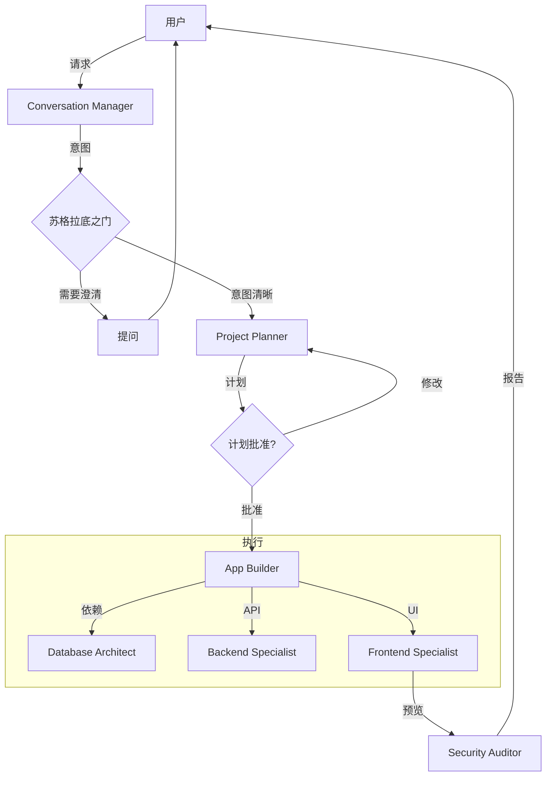

# 智能体协同 (Agent Coordination)

> **目标:** 协调专业智能体的执行顺序和数据流。

## 工作流流程

## 执行顺序

| 阶段 | 智能体                          | 并行? | 先决条件        | 检查点                |
| ---- | ------------------------------- | ----- | --------------- | --------------------- |
| 0    | 苏格拉底之门                    | ❌    | -               | ✅ 问 3 个问题        |
| 1    | Project Planner                 | ❌    | 问题已回答      | ✅ **PLAN.md 已创建** |
| 1.5  | **计划验证**                    | ❌    | PLAN.md 存在    | ✅ **根目录存在文件** |
| 2    | Database Architect              | ❌    | 计划就绪        | Schema 已定义         |
| 3    | Backend Specialist              | ❌    | Schema 就绪     | API 路由已创建        |
| 4    | Frontend Specialist             | ✅    | API 就绪 (部分) | UI 组件就绪           |
| 5    | Security Auditor, Test Engineer | ✅    | 代码就绪        | 测试与审计通过        |
| 6    | DevOps Engineer                 | ❌    | 所有代码就绪    | 部署就绪              |

> 🔴 **关键:** 阶段 1.5 是强制性的。没有 PLAN.md 验证，任何专家智能体不得进行。
