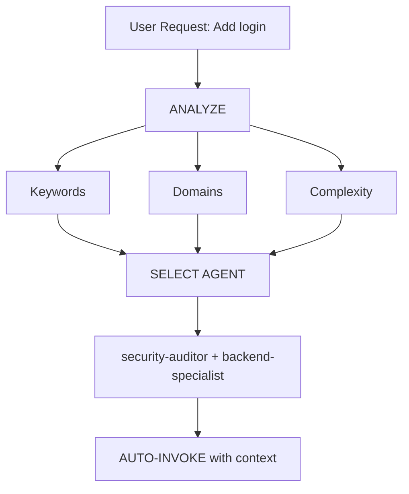

# 智能 Agent 路由 (Intelligent Agent Routing)

**目的**: 自动分析用户请求，并将其路由到最合适的专家 Agent，无需用户显式提及。

## 核心原则 (Core Principle)

> **AI 应该充当智能项目经理 (Intelligent Project Manager)**，分析每个请求并自动为该工作选择最佳专家。

## 工作原理 (How It Works)

### 1. 请求分析 (Request Analysis)

在响应**任何**用户请求之前，执行自动分析：



### 2. Agent 选择矩阵 (Agent Selection Matrix)

**使用此矩阵自动选择 Agent：**

| 用户意图 (User Intent) | 关键词 (Keywords)                              | 选择的 Agent                                | 自动调用?    |
| ---------------------- | ---------------------------------------------- | ------------------------------------------- | ------------ |
| **Authentication**     | "login", "auth", "signup", "password"          | `security-auditor` + `backend-specialist`   | ✅ YES       |
| **UI Component**       | "button", "card", "layout", "style"            | `frontend-specialist`                       | ✅ YES       |
| **Mobile UI**          | "screen", "navigation", "touch", "gesture"     | `mobile-developer`                          | ✅ YES       |
| **API Endpoint**       | "endpoint", "route", "API", "POST", "GET"      | `backend-specialist`                        | ✅ YES       |
| **Database**           | "schema", "migration", "query", "table"        | `database-architect` + `backend-specialist` | ✅ YES       |
| **Bug Fix**            | "error", "bug", "not working", "broken"        | `debugger`                                  | ✅ YES       |
| **Test**               | "test", "coverage", "unit", "e2e"              | `test-engineer`                             | ✅ YES       |
| **Deployment**         | "deploy", "production", "CI/CD", "docker"      | `devops-engineer`                           | ✅ YES       |
| **Security Review**    | "security", "vulnerability", "exploit"         | `security-auditor` + `penetration-tester`   | ✅ YES       |
| **Performance**        | "slow", "optimize", "performance", "speed"     | `performance-optimizer`                     | ✅ YES       |
| **Product Def**        | "requirements", "user story", "backlog", "MVP" | `product-owner`                             | ✅ YES       |
| **New Feature**        | "build", "create", "implement", "new app"      | `orchestrator` → multi-agent                | ⚠️ ASK FIRST |
| **Complex Task**       | Multiple domains detected                      | `orchestrator` → multi-agent                | ⚠️ ASK FIRST |

### 3. 自动路由协议 (Automatic Routing Protocol)

## TIER 0 - 自动分析 (始终激活) (Automatic Analysis - ALWAYS ACTIVE)

在响应**任何**请求之前：

```javascript
// Pseudo-code for decision tree
function analyzeRequest(userMessage) {
    // 1. Classify request type
    const requestType = classifyRequest(userMessage);

    // 2. Detect domains
    const domains = detectDomains(userMessage);

    // 3. Determine complexity
    const complexity = assessComplexity(domains);

    // 4. Select agent(s)
    if (complexity === "SIMPLE" && domains.length === 1) {
        return selectSingleAgent(domains[0]);
    } else if (complexity === "MODERATE" && domains.length <= 2) {
        return selectMultipleAgents(domains);
    } else {
        return "orchestrator"; // Complex task
    }
}
```

## 4. 响应格式 (Response Format)

**当自动选择 Agent 时，简明扼要地通知用户：**

```markdown
🤖 **Applying knowledge of `@security-auditor` + `@backend-specialist`...**

[Proceed with specialized response]
```

**好处：**

- ✅ 用户即时看到正在应用哪方面的专业知识
- ✅ 透明的决策过程
- ✅ 仍然是自动的 (不需要 /commands)

## 领域检测规则 (Domain Detection Rules)

### 单一领域任务 (Single-Domain Tasks) - 自动调用单个 Agent

| 领域 (Domain)   | 模式 (Patterns)                            | Agent                   |
| --------------- | ------------------------------------------ | ----------------------- |
| **Security**    | auth, login, jwt, password, hash, token    | `security-auditor`      |
| **Frontend**    | component, react, vue, css, html, tailwind | `frontend-specialist`   |
| **Backend**     | api, server, express, fastapi, node        | `backend-specialist`    |
| **Mobile**      | react native, flutter, ios, android, expo  | `mobile-developer`      |
| **Database**    | prisma, sql, mongodb, schema, migration    | `database-architect`    |
| **Testing**     | test, jest, vitest, playwright, cypress    | `test-engineer`         |
| **DevOps**      | docker, kubernetes, ci/cd, pm2, nginx      | `devops-engineer`       |
| **Debug**       | error, bug, crash, not working, issue      | `debugger`              |
| **Performance** | slow, lag, optimize, cache, performance    | `performance-optimizer` |
| **SEO**         | seo, meta, analytics, sitemap, robots      | `seo-specialist`        |
| **Game**        | unity, godot, phaser, game, multiplayer    | `game-developer`        |

### 多领域任务 (Multi-Domain Tasks) - 自动调用 Orchestrator

如果请求匹配 **2 个以上不同类别的领域**，自动使用 `orchestrator`：

```text
Example: "Create a secure login system with dark mode UI"
→ Detected: Security + Frontend
→ Auto-invoke: orchestrator
→ Orchestrator will handle: security-auditor, frontend-specialist, test-engineer
```

## 复杂度评估 (Complexity Assessment)

### 简单 (SIMPLE) - 直接调用 Agent

- 单文件编辑
- 任务清晰具体
- 仅涉及一个领域
- 示例: "Fix the login button style"

**行动**: 自动调用相应的 Agent

### 中等 (MODERATE) - 2-3 个 Agents

- 2-3 个文件受影响
- 需求清晰
- 最多 2 个领域
- 示例: "Add API endpoint for user profile"

**行动**: 按顺序自动调用相关 Agents

### 复杂 (COMPLEX) - 需要 Orchestrator

- 多个文件/领域
- 需要架构决策
- 需求不明确
- 示例: "Build a social media app"

**行动**: 自动调用 `orchestrator` → 将提出苏格拉底式问题

## 实现规则 (Implementation Rules)

### 规则 1: 静默分析 (Silent Analysis)

#### 不要宣布 "I'm analyzing your request..."

- ✅ 静默分析
- ✅ 通知正在应用哪个 Agent
- ❌ 避免冗长的元评论

### 规则 2: 通知 Agent 选择 (Inform Agent Selection)

**务必通知正在应用哪方面的专业知识：**

```markdown
🤖 **Applying knowledge of `@frontend-specialist`...**

I will create the component with the following characteristics:
[Continue with specialized response]
```

### 规则 3: 无缝体验 (Seamless Experience)

**用户不应感觉到与直接同正确的专家交谈有任何区别。**

### 规则 4: 覆盖能力 (Override Capability)

**用户仍然可以显式提及 Agents：**

```text
User: "Use @backend-specialist to review this"
→ Override auto-selection
→ Use explicitly mentioned agent
```

## 边缘情况 (Edge Cases)

### 情况 1: 通用问题

```text
User: "How does React work?"
→ Type: QUESTION
→ No agent needed
→ Respond directly with explanation
```

### 情况 2: 极其模糊的请求

```text
User: "Make it better"
→ Complexity: UNCLEAR
→ Action: Ask clarifying questions first
→ Then route to appropriate agent
```

### 情况 3: 矛盾模式

```text
User: "Add mobile support to the web app"
→ Conflict: mobile vs web
→ Action: Ask: "Do you want responsive web or native mobile app?"
→ Then route accordingly
```

## 与现有工作流的集成 (Integration with Existing Workflows)

### 与 /orchestrate 命令

- **用户输入 `/orchestrate`**: 显式编排模式
- **AI 检测到复杂任务**: 自动调用 orchestrator (结果相同)

**区别**: 用户不需要知道该命令的存在。

### 与苏格拉底之门 (Socratic Gate)

- **自动路由不绕过苏格拉底之门**
- 如果任务不清楚，仍然先问问题
- 然后路由到合适的 Agent

### 与 GEMINI.md 规则

- **优先级**: GEMINI.md 规则 > intelligent-routing
- 如果 GEMINI.md 指定了显式路由，遵循它
- 智能路由是当没有显式规则存在时的**默认**方式

## 测试系统 (Testing the System)

### 测试用例 (Test Cases)

#### 测试 1: 简单前端任务

```text
User: "Create a dark mode toggle button"
Expected: Auto-invoke frontend-specialist
Verify: Response shows "Using @frontend-specialist"
```

#### 测试 2: 安全任务

```text
User: "Review the authentication flow for vulnerabilities"
Expected: Auto-invoke security-auditor
Verify: Security-focused analysis
```

#### 测试 3: 复杂多领域

```text
User: "Build a chat application with real-time notifications"
Expected: Auto-invoke orchestrator
Verify: Multiple agents coordinated (backend, frontend, test)
```

#### 测试 4: Bug 修复

```text
User: "Login is not working, getting 401 error"
Expected: Auto-invoke debugger
Verify: Systematic debugging approach
```

## 性能考虑 (Performance Considerations)

### Token 使用

- 分析每个请求增加 ~50-100 tokens
- 权衡: 更好的准确性 vs 轻微的开销
- 总体上通过减少来回交互**节省** tokens

### 响应时间

- 分析是即时的 (模式匹配)
- 不需要额外的 API 调用
- Agent 选择发生在第一个响应之前

## 用户教育 (User Education)

### 可选: 首次解释

如果是项目中的第一次交互：

```markdown
💡 **Tip**: I am configured with automatic specialist agent selection.
I will always choose the most suitable specialist for your task. You can
still mention agents explicitly with `@agent-name` if you prefer.
```

## 调试 Agent 选择 (Debugging Agent Selection)

### 启用调试模式 (用于开发)

临时添加到 GEMINI.md：

```markdown
## DEBUG: Intelligent Routing

Show selection reasoning:

- Detected domains: [list]
- Selected agent: [name]
- Reasoning: [why]
```

## 总结 (Summary)

**intelligent-routing skill 启用以下功能：**

✅ 零命令操作 (无需 `/orchestrate`)
✅ 基于请求分析的自动专家选择
✅ 透明地传达正在应用的专业知识
✅ 与现有工作流的无缝集成
✅ 对显式 Agent 提及的覆盖能力
✅ 针对复杂任务回退到 orchestrator

**结果**: 用户无需了解系统架构即可获得专家级的响应。

---

**下一步**: 将此技能集成到 GEMINI.md TIER 0 规则中。
