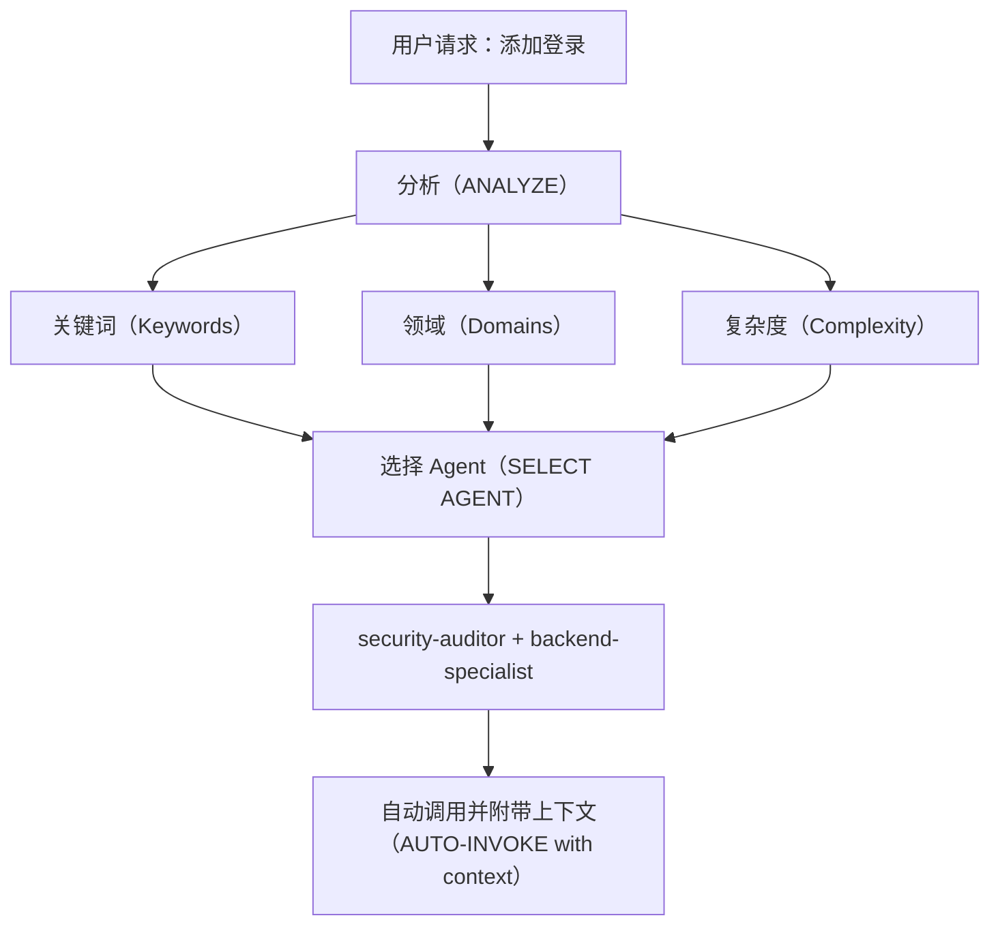

# 智能 Agent 路由

**目标（Purpose）**：自动分析用户请求，并在无需用户显式提及 Agent（智能代理）的情况下，路由到最合适的专家 Agent。

## 核心原则（Core Principle）

> **AI 应像智能项目经理一样工作**：分析每个请求，并自动选择最适合的专家组合。

## 工作方式（How It Works）

### 1. 请求分析（Request Analysis）

在响应任何用户请求之前，自动执行分析：



### 2. Agent 选择矩阵（Agent Selection Matrix）

**使用此矩阵自动选择 Agent：**

| 用户意图（User Intent） | 关键词（Keywords） | 选择的 Agent（Selected Agent(s)） | 自动调用？（Auto-invoke?） |
| ----------------------- | ----------------- | --------------------------------- | -------------------------- |
| **身份认证（Authentication）** | login, auth, signup, password（登录、认证、注册、密码） | `security-auditor` + `backend-specialist` | ✅ 是（YES） |
| **UI 组件（UI Component）** | button, card, layout, style（按钮、卡片、布局、样式） | `frontend-specialist` | ✅ 是（YES） |
| **移动端 UI（Mobile UI）** | screen, navigation, touch, gesture（界面、导航、触控、手势） | `mobile-developer` | ✅ 是（YES） |
| **API 端点（API Endpoint）** | endpoint, route, API, POST, GET（端点、路由、接口、POST/GET 请求） | `backend-specialist` | ✅ 是（YES） |
| **数据库（Database）** | schema, migration, query, table（模式、迁移、查询、表） | `database-architect` + `backend-specialist` | ✅ 是（YES） |
| **缺陷修复（Bug Fix）** | error, bug, not working, broken（错误、缺陷、不工作、损坏） | `debugger` | ✅ 是（YES） |
| **测试（Test）** | test, coverage, unit, e2e（测试、覆盖率、单元、端到端） | `test-engineer` | ✅ 是（YES） |
| **部署（Deployment）** | deploy, production, CI/CD, docker（部署、生产、持续集成/交付、容器） | `devops-engineer` | ✅ 是（YES） |
| **安全评审（Security Review）** | security, vulnerability, exploit（安全、漏洞、利用） | `security-auditor` + `penetration-tester` | ✅ 是（YES） |
| **性能优化（Performance）** | slow, optimize, performance, speed（慢、优化、性能、速度） | `performance-optimizer` | ✅ 是（YES） |
| **产品定义（Product Def）** | requirements, user story, backlog, MVP（需求、用户故事、待办、最小可行产品） | `product-owner` | ✅ 是（YES） |
| **新功能（New Feature）** | build, create, implement, new app（构建、创建、实现、新应用） | `orchestrator` → multi-agent（多代理） | ⚠️ 先询问（ASK FIRST） |
| **复杂任务（Complex Task）** | Multiple domains detected（检测到多个领域） | `orchestrator` → multi-agent（多代理） | ⚠️ 先询问（ASK FIRST） |

### 3. 自动路由协议（Automatic Routing Protocol）

## TIER 0（第 0 层级）- 自动分析（始终启用，ALWAYS ACTIVE）

在响应任何请求之前：

```javascript
// 决策树伪代码
function analyzeRequest(userMessage) {
    // 1. 分类请求类型
    const requestType = classifyRequest(userMessage);

    // 2. 识别领域
    const domains = detectDomains(userMessage);

    // 3. 评估复杂度
    const complexity = assessComplexity(domains);

    // 4. 选择 Agent
    if (complexity === "SIMPLE" && domains.length === 1) {
        return selectSingleAgent(domains[0]);
    } else if (complexity === "MODERATE" && domains.length <= 2) {
        return selectMultipleAgents(domains);
    } else {
        return "orchestrator"; // 复杂任务
    }
}
```

## 4. 回复格式（Response Format）

**当自动选择 Agent 时，用简洁方式告知用户：**

```markdown
🤖 **正在应用 `@security-auditor` + `@backend-specialist` 的知识...**

[继续给出专业化回复]
```

**收益（Benefits）：**

- ✅ 用户可见当前应用的专业能力
- ✅ 决策过程透明
- ✅ 仍然是自动化流程（无需 /commands）

## 领域识别规则（Domain Detection Rules）

### 单领域任务（自动调用单 Agent）

| 领域（Domain） | 模式/关键词（Patterns） | Agent（Agent） |
| ------------- | ----------------------- | ------------- |
| **安全（Security）** | auth, login, jwt, password, hash, token（认证、登录、JWT、密码、哈希、令牌） | `security-auditor` |
| **前端（Frontend）** | component, react, vue, css, html, tailwind（组件、React、Vue、CSS、HTML、Tailwind） | `frontend-specialist` |
| **后端（Backend）** | api, server, express, fastapi, node（API、服务器、Express、FastAPI、Node） | `backend-specialist` |
| **移动端（Mobile）** | react native, flutter, ios, android, expo（React Native、Flutter、iOS、Android、Expo） | `mobile-developer` |
| **数据库（Database）** | prisma, sql, mongodb, schema, migration（Prisma、SQL、MongoDB、模式、迁移） | `database-architect` |
| **测试（Testing）** | test, jest, vitest, playwright, cypress（测试、Jest、Vitest、Playwright、Cypress） | `test-engineer` |
| **DevOps** | docker, kubernetes, ci/cd, pm2, nginx（Docker、Kubernetes、CI/CD、PM2、Nginx） | `devops-engineer` |
| **调试（Debug）** | error, bug, crash, not working, issue（错误、缺陷、崩溃、不工作、问题） | `debugger` |
| **性能（Performance）** | slow, lag, optimize, cache, performance（慢、卡顿、优化、缓存、性能） | `performance-optimizer` |
| **SEO** | seo, meta, analytics, sitemap, robots（SEO、元信息、分析、站点地图、robots） | `seo-specialist` |
| **游戏（Game）** | unity, godot, phaser, game, multiplayer（Unity、Godot、Phaser、游戏、多玩家） | `game-developer` |

### 多领域任务（自动调用 orchestrator）

如果请求匹配来自不同类别的 **2 个及以上领域**，自动使用 `orchestrator`（编排器）：

```text
示例：“创建一个带深色模式 UI 的安全登录系统”
→ 检测到：安全 + 前端
→ 自动调用：orchestrator
→ orchestrator 将协同：security-auditor、frontend-specialist、test-engineer
```

## 复杂度评估（Complexity Assessment）

### 简单（SIMPLE，直接调用单 Agent）

- 单文件修改
- 任务清晰且具体
- 仅单一领域
- 示例：“修复登录按钮样式”

**动作：** 自动调用对应 Agent

### 中等（MODERATE，2-3 个 Agent）

- 影响 2-3 个文件
- 需求清晰
- 最多 2 个领域
- 示例：“为用户资料新增 API 端点”

**动作：** 按序自动调用相关 Agent

### 复杂（COMPLEX，需要 orchestrator）

- 涉及多文件/多领域
- 需要架构级决策
- 需求不清晰
- 示例：“做一个社交媒体应用”

**动作：** 自动调用 `orchestrator`（编排器）→ 进入苏格拉底式提问（Socratic Questions）

## 实施规则（Implementation Rules）

### 规则 1：静默分析（Silent Analysis）

#### 不要宣布“我正在分析你的请求...”

- ✅ 静默完成分析
- ✅ 告知正在应用哪个专家能力
- ❌ 避免冗长元叙事

### 规则 2：告知 Agent 选择（Inform Agent Selection）

**必须告知正在应用的专家能力：**

```markdown
🤖 **正在应用 `@frontend-specialist` 的知识...**

我会按以下特征创建该组件：
[继续给出专业化回复]
```

### 规则 3：无缝体验（Seamless Experience）

**用户的体验应与“直接和对应专家沟通”一致。**

### 规则 4：显式覆盖能力（Override Capability）

**用户仍可显式点名 Agent：**

```text
用户：“使用 @backend-specialist 帮我审查（review）这段代码”
→ 覆盖自动选择
→ 使用用户显式指定的 Agent
```

## 边界场景（Edge Cases）

### 场景 1：通用问题

```text
用户：“React 是如何工作的？”
→ 类型：问题（QUESTION）
→ 无需调用 Agent
→ 直接解释回答
```

### 场景 2：极度模糊请求

```text
用户：“把它做得更好”
→ 复杂度：不明确（UNCLEAR）
→ 动作：先提澄清问题
→ 之后再路由到合适 Agent
```

### 场景 3：模式冲突

```text
用户：“给 Web（网页）应用加上移动端支持”
→ 冲突：移动端 vs Web
→ 动作：先问“你要的是响应式 Web（网页），还是原生移动 App（应用）？”
→ 再按结论路由
```
