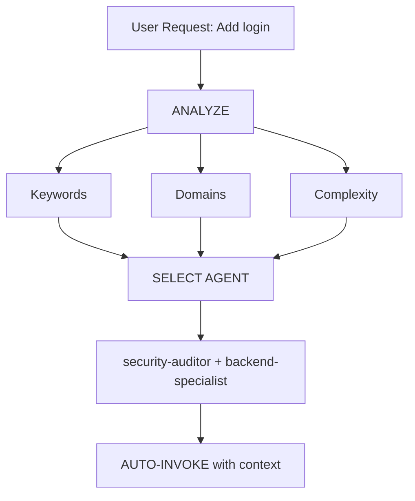

# 智能 Agent 路由

**目标**：自动分析用户请求，并在无需用户显式提及 Agent 的情况下路由到最合适的专家 Agent。

## 核心原则

> **AI 应像智能项目经理一样工作**：分析每个请求，并自动选择最适合的专家。

## 工作方式

### 1. 请求分析

在响应任何用户请求之前，自动执行分析：



### 2. Agent 选择矩阵

**使用此矩阵自动选择 Agent：**

| 用户意图 | 关键词 | 选择的 Agent | 自动调用？ |
| --- | --- | --- | --- |
| **Authentication（身份认证）** | "login", "auth", "signup", "password" | `security-auditor` + `backend-specialist` | ✅ YES |
| **UI Component（UI 组件）** | "button", "card", "layout", "style" | `frontend-specialist` | ✅ YES |
| **Mobile UI（移动端 UI）** | "screen", "navigation", "touch", "gesture" | `mobile-developer` | ✅ YES |
| **API Endpoint（API 端点）** | "endpoint", "route", "API", "POST", "GET" | `backend-specialist` | ✅ YES |
| **Database（数据库）** | "schema", "migration", "query", "table" | `database-architect` + `backend-specialist` | ✅ YES |
| **Bug Fix（缺陷修复）** | "error", "bug", "not working", "broken" | `debugger` | ✅ YES |
| **Test（测试）** | "test", "coverage", "unit", "e2e" | `test-engineer` | ✅ YES |
| **Deployment（部署）** | "deploy", "production", "CI/CD", "docker" | `devops-engineer` | ✅ YES |
| **Security Review（安全评审）** | "security", "vulnerability", "exploit" | `security-auditor` + `penetration-tester` | ✅ YES |
| **Performance（性能）** | "slow", "optimize", "performance", "speed" | `performance-optimizer` | ✅ YES |
| **Product Def（产品定义）** | "requirements", "user story", "backlog", "MVP" | `product-owner` | ✅ YES |
| **New Feature（新功能）** | "build", "create", "implement", "new app" | `orchestrator` → multi-agent | ⚠️ ASK FIRST |
| **Complex Task（复杂任务）** | Multiple domains detected | `orchestrator` → multi-agent | ⚠️ ASK FIRST |

### 3. 自动路由协议

## TIER 0 - 自动分析（始终启用）

在响应任何请求之前：

```javascript
// 决策树伪代码
function analyzeRequest(userMessage) {
    // 1. 分类请求类型
    const requestType = classifyRequest(userMessage);

    // 2. 识别领域
    const domains = detectDomains(userMessage);

    // 3. 评估复杂度
    const complexity = assessComplexity(domains);

    // 4. 选择 Agent
    if (complexity === "SIMPLE" && domains.length === 1) {
        return selectSingleAgent(domains[0]);
    } else if (complexity === "MODERATE" && domains.length <= 2) {
        return selectMultipleAgents(domains);
    } else {
        return "orchestrator"; // 复杂任务
    }
}
```

## 4. 回复格式

**当自动选择 Agent 时，用简洁方式告知用户：**

```markdown
🤖 **正在应用 `@security-auditor` + `@backend-specialist` 的知识...**

[继续给出专业化回复]
```

**收益：**

- ✅ 用户可见当前应用的专业能力
- ✅ 决策过程透明
- ✅ 仍然是自动化流程（无需 /commands）

## 领域识别规则

### 单领域任务（自动调用单 Agent）

| 领域 | 模式/关键词 | Agent |
| --- | --- | --- |
| **Security（安全）** | auth, login, jwt, password, hash, token | `security-auditor` |
| **Frontend（前端）** | component, react, vue, css, html, tailwind | `frontend-specialist` |
| **Backend（后端）** | api, server, express, fastapi, node | `backend-specialist` |
| **Mobile（移动端）** | react native, flutter, ios, android, expo | `mobile-developer` |
| **Database（数据库）** | prisma, sql, mongodb, schema, migration | `database-architect` |
| **Testing（测试）** | test, jest, vitest, playwright, cypress | `test-engineer` |
| **DevOps** | docker, kubernetes, ci/cd, pm2, nginx | `devops-engineer` |
| **Debug（调试）** | error, bug, crash, not working, issue | `debugger` |
| **Performance（性能）** | slow, lag, optimize, cache, performance | `performance-optimizer` |
| **SEO** | seo, meta, analytics, sitemap, robots | `seo-specialist` |
| **Game（游戏）** | unity, godot, phaser, game, multiplayer | `game-developer` |

### 多领域任务（自动调用 orchestrator）

如果请求匹配来自不同类别的 **2 个及以上领域**，自动使用 `orchestrator`：

```text
示例："创建带深色模式 UI 的安全登录系统"
→ 检测到：Security + Frontend
→ 自动调用：orchestrator
→ orchestrator 处理：security-auditor、frontend-specialist、test-engineer
```

## 复杂度评估

### SIMPLE（直接调用单 Agent）

- 单文件修改
- 任务清晰且具体
- 仅单一领域
- 示例："修复登录按钮样式"

**动作**：自动调用对应 Agent

### MODERATE（2-3 个 Agent）

- 影响 2-3 个文件
- 需求清晰
- 最多 2 个领域
- 示例："为用户资料添加 API 端点"

**动作**：按序自动调用相关 Agent

### COMPLEX（需要 orchestrator）

- 涉及多文件/多领域
- 需要架构级决策
- 需求不清晰
- 示例："构建一个社交媒体应用"

**动作**：自动调用 `orchestrator` → 进入苏格拉底式提问

## 实施规则

### 规则 1：静默分析

#### 不要宣布“我正在分析你的请求...”

- ✅ 静默完成分析
- ✅ 告知正在应用哪个专家能力
- ❌ 避免冗长元叙事

### 规则 2：告知 Agent 选择

**必须告知正在应用的专家能力：**

```markdown
🤖 **正在应用 `@frontend-specialist` 的知识...**

我将按以下特征创建该组件：
[继续给出专业化回复]
```

### 规则 3：无缝体验

**用户的体验应与“直接和对应专家沟通”一致。**

### 规则 4：显式覆盖能力

**用户仍可显式点名 Agent：**

```text
用户："使用 @backend-specialist 帮我审查这段代码"
→ 覆盖自动选择
→ 使用用户显式指定的 Agent
```

## 边界场景

### 场景 1：通用问题

```text
用户："React 是如何工作的？"
→ 类型：QUESTION
→ 无需调用 Agent
→ 直接解释回答
```

### 场景 2：极度模糊请求

```text
用户："把它做得更好"
→ 复杂度：UNCLEAR
→ 动作：先提澄清问题
→ 然后再路由到合适 Agent
```

### 场景 3：模式冲突

```text
用户："给 Web 应用加上移动端支持"
→ 冲突：mobile vs web
→ 动作：先问“你要的是响应式 Web，还是原生移动 App？”
→ 再按结论路由
```

## 与现有工作流的集成

### 与 /orchestrate 命令

- **用户输入 `/orchestrate`**：显式进入编排模式
- **AI 检测复杂任务**：自动调用 orchestrator（同样效果）

**区别**：用户不需要知道命令存在。

### 与苏格拉底式门控

- **自动路由不会绕过苏格拉底式门控**
- 若任务不清晰，仍应先提问
- 然后再路由到合适 Agent

### 与 GEMINI.md 规则

- **优先级**：GEMINI.md 规则 > intelligent-routing
- 若 GEMINI.md 指定明确路由，遵循其规则
- 无显式规则时，智能路由作为默认
