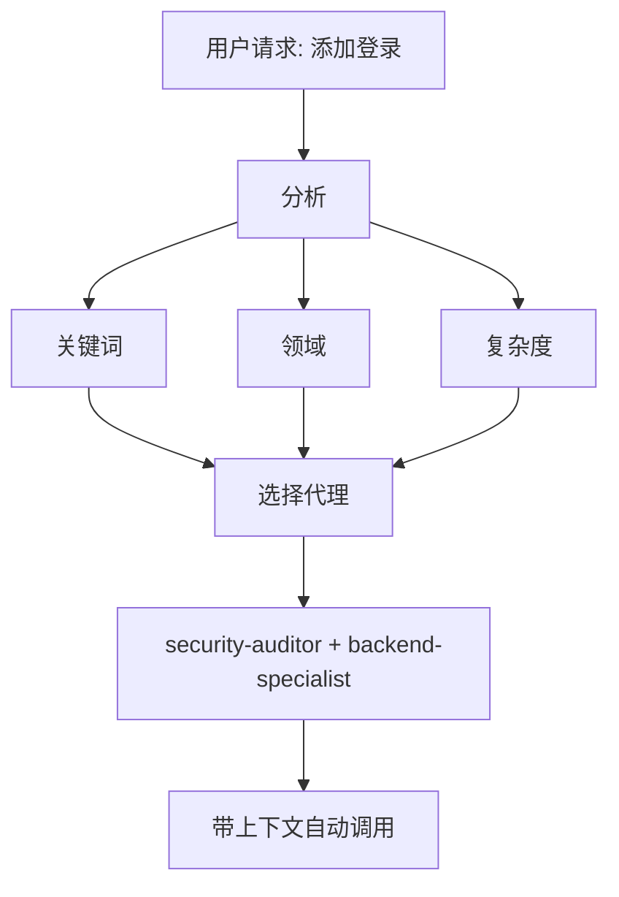

# 智能代理路由 (Intelligent Agent Routing)

**目的 (Purpose)**：自动分析用户请求，并将它们路由到最合适的专家代理 (Specialist Agent)，无需用户明确提及。

## 核心原则

> **AI 应当作为一个智能项目经理 (Intelligent Project Manager)**，分析每个请求并自动为该工作选择最佳专家。

## 工作原理 (How It Works)

### 1. 请求分析

在响应任何用户请求之前，执行自动分析：



### 2. 代理选择矩阵

**使用此矩阵自动选择代理：**

| 用户意图                       | 关键词                                         | 所选代理                                    | 自动调用? |
| ------------------------------ | ---------------------------------------------- | ------------------------------------------- | --------- |
| **Authentication (认证)**      | "login", "auth", "signup", "password"          | `security-auditor` + `backend-specialist`   | ✅ 是     |
| **UI Component (UI 组件)**     | "button", "card", "layout", "style"            | `frontend-specialist`                       | ✅ 是     |
| **Mobile UI (移动 UI)**        | "screen", "navigation", "touch", "gesture"     | `mobile-developer`                          | ✅ 是     |
| **API Endpoint (API 端点)**    | "endpoint", "route", "API", "POST", "GET"      | `backend-specialist`                        | ✅ 是     |
| **Database (数据库)**          | "schema", "migration", "query", "table"        | `database-architect` + `backend-specialist` | ✅ 是     |
| **Bug Fix (Bug 修复)**         | "error", "bug", "not working", "broken"        | `debugger`                                  | ✅ 是     |
| **Test (测试)**                | "test", "coverage", "unit", "e2e"              | `test-engineer`                             | ✅ 是     |
| **Deployment (部署)**          | "deploy", "production", "CI/CD", "docker"      | `devops-engineer`                           | ✅ 是     |
| **Security Review (安全审查)** | "security", "vulnerability", "exploit"         | `security-auditor` + `penetration-tester`   | ✅ 是     |
| **Performance (性能)**         | "slow", "optimize", "performance", "speed"     | `performance-optimizer`                     | ✅ 是     |
| **Product Def (产品定义)**     | "requirements", "user story", "backlog", "MVP" | `product-owner`                             | ✅ 是     |
| **New Feature (新功能)**       | "build", "create", "implement", "new app"      | `orchestrator` → multi-agent (多代理)       | ⚠️ 先询问 |
| **Complex Task (复杂任务)**    | Multiple domains detected (检测到多个领域)     | `orchestrator` → multi-agent (多代理)       | ⚠️ 先询问 |

### 3. 自动路由协议

## TIER 0 - 自动分析 (始终激活)

在响应任何请求之前：

```javascript
// 决策树伪代码
function analyzeRequest(userMessage) {
    // 1. 分类请求类型
    const requestType = classifyRequest(userMessage);

    // 2. 检测领域
    const domains = detectDomains(userMessage);

    // 3. 确定复杂度
    const complexity = assessComplexity(domains);

    // 4. 选择代理
    if (complexity === "SIMPLE" && domains.length === 1) {
        return selectSingleAgent(domains[0]);
    } else if (complexity === "MODERATE" && domains.length <= 2) {
        return selectMultipleAgents(domains);
    } else {
        return "orchestrator"; // 复杂任务
    }
}
```

## 4. 响应格式

**当自动选择代理时，简洁地告知用户：**

```markdown
🤖 **正在应用 `@security-auditor` + `@backend-specialist` 的知识...**

[继续特定的响应]
```

**好处：**

- ✅ 用户看到正在应用哪些专业知识
- ✅ 透明的决策制定
- ✅ 仍然是自动的 (不需要 /commands)

## 领域检测规则

### 单领域任务 (自动调用单个代理)

| 领域            | 模式                                       | 代理                    |
| --------------- | ------------------------------------------ | ----------------------- |
| **Security**    | auth, login, jwt, password, hash, token    | `security-auditor`      |
| **Frontend**    | component, react, vue, css, html, tailwind | `frontend-specialist`   |
| **Backend**     | api, server, express, fastapi, node        | `backend-specialist`    |
| **Mobile**      | react native, flutter, ios, android, expo  | `mobile-developer`      |
| **Database**    | prisma, sql, mongodb, schema, migration    | `database-architect`    |
| **Testing**     | test, jest, vitest, playwright, cypress    | `test-engineer`         |
| **DevOps**      | docker, kubernetes, ci/cd, pm2, nginx      | `devops-engineer`       |
| **Debug**       | error, bug, crash, not working, issue      | `debugger`              |
| **Performance** | slow, lag, optimize, cache, performance    | `performance-optimizer` |
| **SEO**         | seo, meta, analytics, sitemap, robots      | `seo-specialist`        |
| **Game**        | unity, godot, phaser, game, multiplayer    | `game-developer`        |

### 多领域任务 (自动调用编排器)

如果请求匹配 **来自不同类别的 2 个以上领域**，自动使用 `orchestrator`：

```text
示例："创建一个带有暗色模式 UI 的安全登录系统"
→ 检测到：Security + Frontend
→ 自动调用：orchestrator
→ 编排器将处理：security-auditor, frontend-specialist, test-engineer
```

## 复杂度评估

### SIMPLE (简单 - 直接代理调用)

- 单文件编辑
- 清晰、具体的任务
- 仅一个领域
- 示例："修复登录按钮样式"

**行动**：自动调用相应的代理

### MODERATE (中等 - 2-3 个代理)

- 影响 2-3 个文件
- 清晰的需求
- 最多 2 个领域
- 示例："为用户资料添加 API 端点"

**行动**：按顺序自动调用相关代理

### COMPLEX (复杂 - 需要编排器)

- 多个文件/领域
- 需要架构决策
- 不清楚的需求
- 示例："构建一个社交媒体应用"

**行动**：自动调用 `orchestrator` → 也就是先问苏格拉底式问题

## 实现规则

### 规则 1：静默分析 (Silent Analysis)

#### 不要宣布 "我正在分析你的请求..."

- ✅ 静默分析
- ✅ 告知正在应用哪个代理
- ❌ 避免冗长的元评论

### 规则 2：告知代理选择 (Inform Agent Selection)

**要告知正在应用哪些专业知识：**

```markdown
🤖 **正在应用 `@frontend-specialist` 的知识...**

我将创建具有以下特征的组件：
[继续特定的响应]
```

### 规则 3：无缝体验 (Seamless Experience)

**用户不应察觉到与直接同合适的专家交谈有什么区别。**

### 规则 4：覆盖能力 (Override Capability)

**用户仍然可以明确提及代理：**

```text
User: "使用 @backend-specialist 来审查这个"
→ 覆盖自动选择
→ 使用明确提及的代理
```

## 边缘情况

### 情况 1：通用问题

```text
User: "React 是如何工作的？"
→ 类型：QUESTION (提问)
→ 不需要代理
→ 直接回复解释
```

### 情况 2：极其模糊的请求

```text
User: "把它弄好点"
→ 复杂度：UNCLEAR (不清楚)
→ 行动：先问澄清问题
→ 然后路由到合适的代理
```

### 情况 3：矛盾的模式

```text
User: "给 Web 应用添加移动支持"
→ 冲突：移动 vs Web
→ 行动：问："你想要响应式 Web 还是原生移动应用？"
→ 然后相应地路由
```

## 与现有工作流集成

### 与 /orchestrate 命令

- **用户输入 `/orchestrate`**：明确的编排模式
- **AI 检测到复杂任务**：自动调用编排器 (结果相同)

**区别**：用户不需要知道命令的存在。

### 与苏格拉底之门 (Socratic Gate)

- **自动路由不绕过苏格拉底之门**
- 如果任务不清楚，仍然先问问题
- 然后路由到合适的代理

### 与 GEMINI.md 规则

- **优先级**：GEMINI.md 规则 > intelligent-routing
- 如果 GEMINI.md 指定了明确的路由，遵循它
- 智能路由是当没有明确规则存在时的默认

## 测试系统

### 测试用例

#### 测试 1：简单前端任务

```text
User: "创建一个暗色模式切换按钮"
Expected: 自动调用 frontend-specialist
Verify: 响应显示 "正在应用 @frontend-specialist"
```

#### 测试 2：安全任务

```text
User: "审查认证流程的漏洞"
Expected: 自动调用 security-auditor
Verify: 聚焦安全的分析
```

#### 测试 3：复杂多领域

```text
User: "构建一个带有实时通知的聊天应用"
Expected: 自动调用 orchestrator
Verify: 多个代理协调 (backend, frontend, test)
```

#### 测试 4：Bug 修复

```text
User: "登录不工作，收到 401 错误"
Expected: 自动调用 debugger
Verify: 系统化调试方法
```

## 性能考量

### Token 使用

- 分析每个请求增加 ~50-100 tokens
- 权衡：更好的准确性 vs 轻微的开销
- 总体上通过减少来回沟通节省 tokens

### 响应时间

- 分析是即时的 (模式匹配)
- 不需要额外的 API 调用
- 代理选择发生在第一次响应之前

## 用户教育

### 可选：首次解释

如果是项目中的第一次互动：

```markdown
💡 **提示**: 我已配置了自动专家代理选择。
我将始终为你的任务选择最合适的专家。如果你愿意，你仍然可以
使用 `@agent-name` 明确提及代理。
```

## 调试代理选择

### 启用调试模式 (用于开发)

临时添加到 GEMINI.md：

```markdown
## DEBUG: Intelligent Routing

展示选择理由：

- Detected domains: [列表]
- Selected agent: [名称]
- Reasoning: [原因]
```

## 总结

**智能路由技能 (intelligent-routing skill) 启用：**

- ✅ 零命令操作 (不需要 `/orchestrate`)
- ✅ 基于请求分析的自动专家选择
- ✅ 透明沟通正在应用的专业知识
- ✅ 与现有工作流无缝集成
- ✅ 明确代理提及的覆盖能力
- ✅ 复杂任务回退到编排器

**结果**：用户获得专家级的响应，而无需了解系统架构。

---

**下一步**：将此技能集成到 GEMINI.md TIER 0 规则中。
