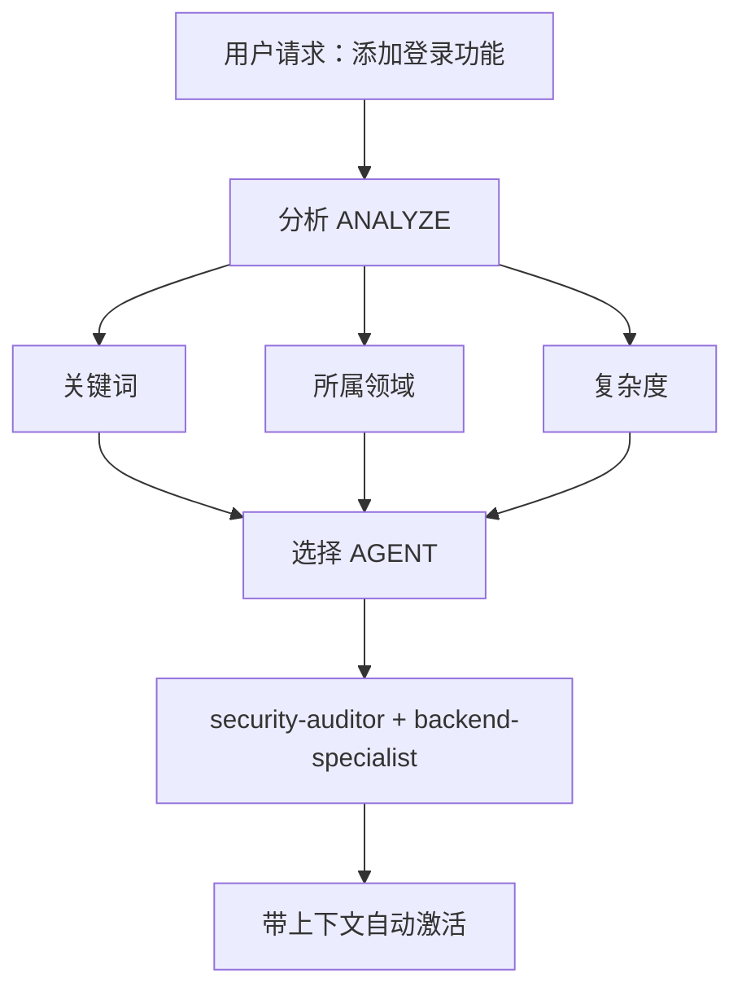

# 智能 Agent 路由 (Intelligent Agent Routing)

**目的**：自动分析用户请求，并将其路由至最合适的专家级 Agent，而无需用户显式提及。

## 核心原则 (Core Principle)

> **AI 应充当智能项目经理 (Project Manager)**，分析每一个请求，并自动为当前任务选择最佳的专家。

---

## 工作机制 (How It Works)

### 1. 请求分析 (Request Analysis)

在对**任何**用户请求做出响应之前，先进行自动分析：



### 2. Agent 选择矩阵 (Agent Selection Matrix)

**使用此矩阵自动选择 Agent：**

| 用户意图            | 关键词                                | 所选 Agent                                  | 是否自动激活？ |
| ------------------- | ------------------------------------- | ------------------------------------------- | -------------- |
| **身份认证 (Auth)** | "登录", "认证", "注册", "密码"        | `security-auditor` + `backend-specialist`   | ✅ 是          |
| **UI 组件**         | "按钮", "卡片", "布局", "样式"        | `frontend-specialist`                       | ✅ 是          |
| **移动端 UI**       | "屏幕", "导航", "触摸", "手势"        | `mobile-developer`                          | ✅ 是          |
| **API 端点**        | "端点", "路由", "API", "POST", "GET"  | `backend-specialist`                        | ✅ 是          |
| **数据库**          | "模式", "迁移", "查询", "表"          | `database-architect` + `backend-specialist` | ✅ 是          |
| **Bug 修复**        | "错误", "Bug", "不工作", "坏了"       | `debugger`                                  | ✅ 是          |
| **测试**            | "测试", "覆盖率", "单元", "E2E"       | `test-engineer`                             | ✅ 是          |
| **部署**            | "部署", "生产环境", "CI/CD", "Docker" | `devops-engineer`                           | ✅ 是          |
| **安全审查**        | "安全", "漏洞", "攻击"                | `security-auditor` + `penetration-tester`   | ✅ 是          |
| **性能**            | "慢", "优化", "性能", "速度"          | `performance-optimizer`                     | ✅ 是          |
| **产品定义**        | "需求", "用户故事", "积压工作", "MVP" | `product-owner`                             | ✅ 是          |
| **新功能**          | "构建", "创建", "实现", "新应用"      | `orchestrator` → 多智能体协作               | ⚠️ 先询问      |
| **复杂任务**        | 检测到涉及多个领域                    | `orchestrator` → 多智能体协作               | ⚠️ 先询问      |

---

### 3. 自动路由协议 (Automatic Routing Protocol)

## TIER 0 - 自动分析 (始终激活)

在响应任何请求之前：

```javascript
// 决策树伪代码示例
function analyzeRequest(userMessage) {
    // 1. 请求类型分类
    const requestType = classifyRequest(userMessage);

    // 2. 领域检测
    const domains = detectDomains(userMessage);

    // 3. 确定复杂度
    const complexity = assessComplexity(domains);

    // 4. 选择 Agent
    if (complexity === "SIMPLE" && domains.length === 1) {
        return selectSingleAgent(domains[0]);
    } else if (complexity === "MODERATE" && domains.length <= 2) {
        return selectMultipleAgents(domains);
    } else {
        return "orchestrator"; // 复杂任务
    }
}
```

---

## 4. 响应格式 (Response Format)

**在自动选择 Agent 时，请简洁地告知老板：**

```markdown
🤖 **正在应用 `@security-auditor` + `@backend-specialist` 的知识……**

[继续进行专业的响应]
```

**优势：**

- ✅ 老板可以看到应用了哪些专业知识。
- ✅ 决策过程透明化。
- ✅ 依然是自动化的（无需手动输入 /命令）。

---

## 领域检测规则 (Domain Detection Rules)

### 单领域任务 (自动激活单个 Agent)

| 领域              | 模式/关键词                                | Agent                   |
| ----------------- | ------------------------------------------ | ----------------------- |
| **安全**          | auth, login, jwt, password, hash, token    | `security-auditor`      |
| **前端**          | component, react, vue, css, html, tailwind | `frontend-specialist`   |
| **后端**          | api, server, express, fastapi, node        | `backend-specialist`    |
| **移动端**        | react native, flutter, ios, android, expo  | `mobile-developer`      |
| **数据库**        | prisma, sql, mongodb, schema, migration    | `database-architect`    |
| **测试**          | test, jest, vitest, playwright, cypress    | `test-engineer`         |
| **运维 (DevOps)** | docker, kubernetes, ci/cd, pm2, nginx      | `devops-engineer`       |
| **调试**          | error, bug, crash, not working, issue      | `debugger`              |
| **性能**          | slow, lag, optimize, cache, performance    | `performance-optimizer` |
| **SEO**           | seo, meta, analytics, sitemap, robots      | `seo-specialist`        |
| **游戏**          | unity, godot, phaser, game, multiplayer    | `game-developer`        |

### 多领域任务 (自动激活编排代理 Orchestrator)

如果请求匹配了 **2 个或更多不同类别**的领域，则自动使用 `orchestrator`：

```text
示例：“创建一个带有暗色模式 UI 的安全登录系统”
→ 检测到：安全 (Security) + 前端 (Frontend)
→ 自动激活：orchestrator
→ Orchestrator 将协调：security-auditor, frontend-specialist, test-engineer
```

---

## 复杂度评估 (Complexity Assessment)

### 简单 (SIMPLE) (直接激活 Agent)

- 单个文件编辑。
- 任务目标清晰且具体。
- 仅涉及单个领域。
- 示例：“修复登录按钮的样式”。

**行动**：自动激活对应的 Agent。

### 中等 (MODERATE) (2-3 个 Agent)

- 涉及 2-3 个文件。
- 需求明确。
- 最多涉及 2 个领域。
- 示例：“为用户个人资料添加 API 端点”。

**行动**：按顺序自动激活相关 Agent。

### 复杂 (COMPLEX) (需要 Orchestrator)

- 涉及多个文件/领域。
- 需要进行架构层面的决策。
- 需求尚不明确。
- 示例：“构建一个社交媒体应用”。

**行动**：自动激活 `orchestrator` → 将会开启苏格拉底式提问。

---

## 实施规则 (Implementation Rules)

### 规则 1：静默分析 (Silent Analysis)

#### **严禁**声明“我正在分析您的请求……”

- ✅ 默默进行分析。
- ✅ 告知正在应用哪个 Agent。
- ❌ 避免冗长的元评论 (Meta-commentary)。

### 规则 2：告知 Agent 选择

**务必告知当前正在应用哪些领域的专业知识：**

```markdown
🤖 **正在应用 `@frontend-specialist` 的知识……**

我将按照以下特性创建该组件：
[继续进行专业的响应]
```

### 规则 3：无缝体验

**老板不应察觉到与直接同正确的专家沟通有任何区别。**

### 规则 4：覆盖能力 (Override)

**老板依然可以显式指定 Agent：**

```text
老板：“请使用 @backend-specialist 来审阅这段代码”
→ 覆盖自动选择逻辑。
→ 使用显式提到的 Agent。
```

---

## 边缘情况 (Edge Cases)

### 情况 1：通用型问题

```text
老板：“React 是如何工作的？”
→ 类型：提问 (QUESTION)
→ 无需特定 Agent。
→ 直接进行解释说明。
```

### 情况 2：极其模糊的请求

```text
老板：“把它做得更好”
→ 复杂度：不明确 (UNCLEAR)
→ 行动：首先进行澄清提问。
→ 然后再路由至合适的 Agent。
```

### 情况 3：冲突模式

```text
老板：“为 Web 应用添加移动端支持”
→ 冲突点：移动端 vs Web
→ 行动：询问：“您是想要响应式 Web 还是原生的移动 App？”
→ 然后根据回复进行路由。
```

---

## 与现有工作流集成 (Integration)

### 与 /orchestrate 命令集成

- **老板输入 `/orchestrate`**：显式进入编排模式。
- **AI 检测到复杂任务**：自动激活 Orchestrator（结果相同）。

**区别**：老板无需知道该命令的存在。

### 与苏格拉底之门 (Socratic Gate) 集成

- **自动路由不应绕过苏格拉底之门。**
- 如果任务不明确，依然要先提问。
- 提问后再路由至合适的 Agent。

### 与 GEMINI.md 规则集成

- **优先级**：GEMINI.md 规则 > 智能路由。
- 如果 GEMINI.md 指定了显式路由，请遵循该规则。
- 智能路由是在没有显式规则时的**默认**方案。

---

## 系统测试 (Testing)

### 测试案例

#### 测试 1：简单前端任务

- 用户请求：“创建一个暗色模式切换按钮”
- 预期结果：自动激活 `frontend-specialist`
- 验证：响应中显示“正在应用 @frontend-specialist……”

#### 测试 2：安全任务

- 用户请求：“审查身份认证流程中的漏洞”
- 预期结果：自动激活 `security-auditor`
- 验证：提供以安全为核心的分析。

#### 测试 3：复杂多领域任务

- 用户请求：“构建一个带有实时通知的聊天应用”
- 预期结果：自动激活 `orchestrator`
- 验证：协调多个 Agent（后端、前端、测试）。

#### 测试 4：Bug 修复

- 用户请求：“登录功能不工作，报错 401”
- 预期结果：自动激活 `debugger`
- 验证：采用系统化的调试方法。

---

## 总结 (Summary)

**智能路由技能实现了：**

✅ **零命令操作**（无需 `/orchestrate`）。
✅ **基于请求分析的专家自动选择**。
✅ **透明告知正在应用哪些专业知识**。
✅ **与现有工作流无缝集成**。
✅ **允许老板显式指定 Agent 进行覆盖**。
✅ **针对复杂任务自动回退至 Orchestrator**。

**结果**：老板无需了解系统架构，即可获得专家级的响应结果。

---

## Skills 兼容说明 (最小补充)

- **机制基线**：沿用上游 `.agent/skills/intelligent-routing/SKILL.md`。
- **Codex 适配**：由适配层映射到 `.agents/skills/intelligent-routing/SKILL.md`。
- **注意**：文档层不改技能流程；仅补充目录映射事实。
