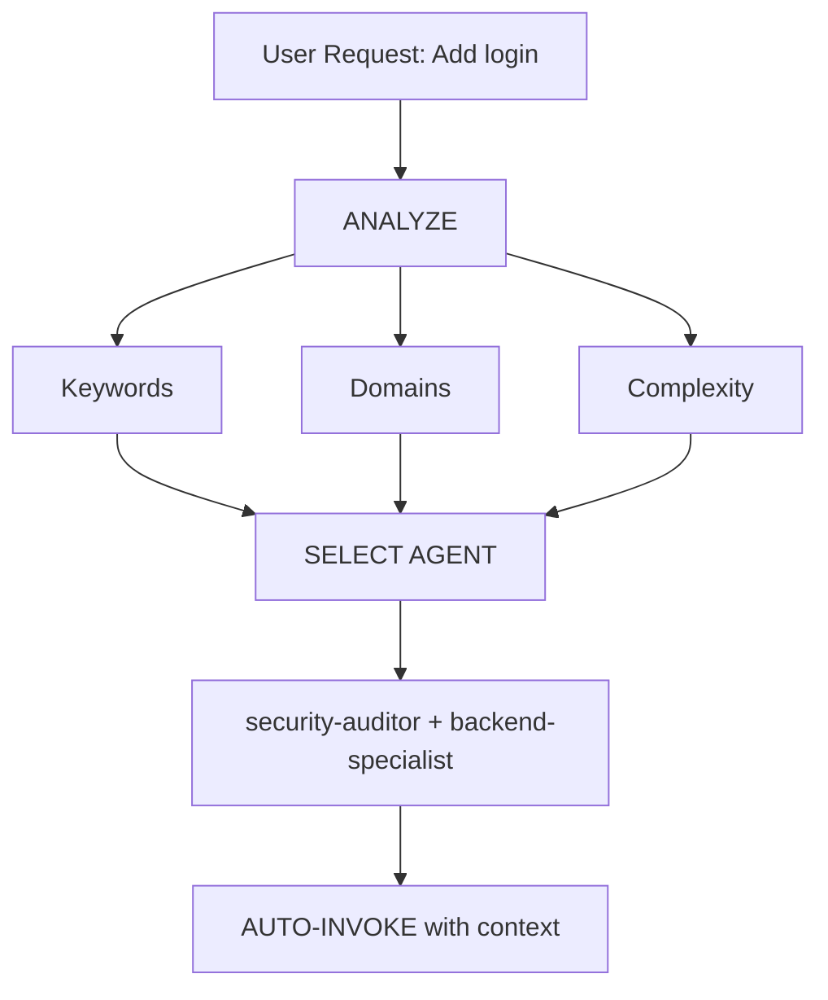

# 智能 Agent 路由 (Intelligent Agent Routing)

**目标 (Purpose)**：自动分析用户请求，并在无需用户显式提及 Agent 的情况下，路由到最合适的专家 Agent。

## 核心原则 (Core Principle)

> **AI 应像智能项目经理一样工作**：分析每个请求，并自动选择最适合的专家组合。

## 工作方式 (How It Works)

### 1. 请求分析 (Request Analysis)

在响应任何用户请求之前，自动执行分析：



### 2. Agent 选择矩阵 (Agent Selection Matrix)

**使用此矩阵自动选择 Agent：**

| User Intent         | Keywords                                   | Selected Agent(s)                           | Auto-invoke? |
| ------------------- | ------------------------------------------ | ------------------------------------------- | ------------ |
| **Authentication**  | "login", "auth", "signup", "password"      | `security-auditor` + `backend-specialist`   | ✅ YES       |
| **UI Component**    | "button", "card", "layout", "style"        | `frontend-specialist`                       | ✅ YES       |
| **Mobile UI**       | "screen", "navigation", "touch", "gesture" | `mobile-developer`                          | ✅ YES       |
| **API Endpoint**    | "endpoint", "route", "API", "POST", "GET"  | `backend-specialist`                        | ✅ YES       |
| **Database**        | "schema", "migration", "query", "table"    | `database-architect` + `backend-specialist` | ✅ YES       |
| **Bug Fix**         | "error", "bug", "not working", "broken"    | `debugger`                                  | ✅ YES       |
| **Test**            | "test", "coverage", "unit", "e2e"          | `test-engineer`                             | ✅ YES       |
| **Deployment**      | "deploy", "production", "CI/CD", "docker"  | `devops-engineer`                           | ✅ YES       |
| **Security Review** | "security", "vulnerability", "exploit"     | `security-auditor` + `penetration-tester`   | ✅ YES       |
| **Performance**     | "slow", "optimize", "performance", "speed" | `performance-optimizer`                     | ✅ YES       |
| **Product Def**     | "requirements", "user story", "backlog", "MVP" | `product-owner`                             | ✅ YES       |
| **New Feature**     | "build", "create", "implement", "new app"  | `orchestrator` → multi-agent                | ⚠️ ASK FIRST |
| **Complex Task**    | Multiple domains detected                  | `orchestrator` → multi-agent                | ⚠️ ASK FIRST |

### 3. 自动路由协议 (Automatic Routing Protocol)

## TIER 0 - 自动分析（始终启用）(ALWAYS ACTIVE)

在响应任何请求之前：

```javascript
// 决策树伪代码
function analyzeRequest(userMessage) {
    // 1. 分类请求类型
    const requestType = classifyRequest(userMessage);

    // 2. 识别领域
    const domains = detectDomains(userMessage);

    // 3. 评估复杂度
    const complexity = assessComplexity(domains);

    // 4. 选择 Agent
    if (complexity === "SIMPLE" && domains.length === 1) {
        return selectSingleAgent(domains[0]);
    } else if (complexity === "MODERATE" && domains.length <= 2) {
        return selectMultipleAgents(domains);
    } else {
        return "orchestrator"; // 复杂任务
    }
}
```

## 4. 回复格式 (Response Format)

**当自动选择 Agent 时，用简洁方式告知用户：**

```markdown
🤖 **正在应用 `@security-auditor` + `@backend-specialist` 的知识...**

[继续给出专业化回复]
```

**收益 (Benefits)：**

- ✅ 用户可见当前应用的专业能力
- ✅ 决策过程透明
- ✅ 仍然是自动化流程（无需 /commands）

## 领域识别规则 (Domain Detection Rules)

### 单领域任务（自动调用单 Agent）

| Domain          | Patterns                                   | Agent                   |
| --------------- | ------------------------------------------ | ----------------------- |
| **Security**    | auth, login, jwt, password, hash, token    | `security-auditor`      |
| **Frontend**    | component, react, vue, css, html, tailwind | `frontend-specialist`   |
| **Backend**     | api, server, express, fastapi, node        | `backend-specialist`    |
| **Mobile**      | react native, flutter, ios, android, expo  | `mobile-developer`      |
| **Database**    | prisma, sql, mongodb, schema, migration    | `database-architect`    |
| **Testing**     | test, jest, vitest, playwright, cypress    | `test-engineer`         |
| **DevOps**      | docker, kubernetes, ci/cd, pm2, nginx      | `devops-engineer`       |
| **Debug**       | error, bug, crash, not working, issue      | `debugger`              |
| **Performance** | slow, lag, optimize, cache, performance    | `performance-optimizer` |
| **SEO**         | seo, meta, analytics, sitemap, robots      | `seo-specialist`        |
| **Game**        | unity, godot, phaser, game, multiplayer    | `game-developer`        |

### 多领域任务（自动调用 Orchestrator）

如果请求匹配来自不同类别的 **2 个及以上领域**，自动使用 `orchestrator`：

```text
示例："创建一个带深色模式 UI 的安全登录系统"
→ 检测到：Security + Frontend
→ 自动调用：orchestrator
→ orchestrator 将协同：security-auditor、frontend-specialist、test-engineer
```

## 复杂度评估 (Complexity Assessment)

### SIMPLE（直接调用单 Agent）

- 单文件修改
- 任务清晰且具体
- 仅单一领域
- 示例："修复登录按钮样式"

**动作：** 自动调用对应 Agent

### MODERATE（2-3 个 Agent）

- 影响 2-3 个文件
- 需求清晰
- 最多 2 个领域
- 示例："为用户资料新增 API 端点"

**动作：** 按序自动调用相关 Agent

### COMPLEX（需要 Orchestrator）

- 涉及多文件/多领域
- 需要架构级决策
- 需求不清晰
- 示例："做一个社交媒体应用"

**动作：** 自动调用 `orchestrator` → 进入苏格拉底式提问 (Socratic Questions)

## 实施规则 (Implementation Rules)

### 规则 1：静默分析 (Silent Analysis)

#### 不要宣布 “我正在分析你的请求...”

- ✅ 静默完成分析
- ✅ 告知正在应用哪个专家能力
- ❌ 避免冗长元叙事

### 规则 2：告知 Agent 选择 (Inform Agent Selection)

**必须告知正在应用的专家能力：**

```markdown
🤖 **正在应用 `@frontend-specialist` 的知识...**

我会按以下特征创建该组件：
[继续给出专业化回复]
```

### 规则 3：无缝体验 (Seamless Experience)

**用户的体验应与“直接和对应专家沟通”一致。**

### 规则 4：显式覆盖能力 (Override Capability)

**用户仍可显式点名 Agent：**

```text
用户："使用 @backend-specialist 帮我 review 这段代码"
→ 覆盖自动选择
→ 使用用户显式指定的 Agent
```

## 边界场景 (Edge Cases)

### 场景 1：通用问题

```text
用户："React 是如何工作的？"
→ 类型：QUESTION
→ 无需调用 Agent
→ 直接解释回答
```

### 场景 2：极度模糊请求

```text
用户："把它做得更好"
→ 复杂度：UNCLEAR
→ 动作：先提澄清问题
→ 之后再路由到合适 Agent
```

### 场景 3：模式冲突

```text
用户："给 Web 应用加上移动端支持"
→ 冲突：mobile vs web
→ 动作：先问“你要的是响应式 Web，还是原生移动 App？”
→ 再按结论路由
```

## 与现有工作流的集成 (Integration with Existing Workflows)

### 与 `/orchestrate` 命令协作

- **用户输入 `/orchestrate`**：显式进入编排模式
- **AI 检测到复杂任务**：自动调用 orchestrator（结果一致）

**差异：** 用户不需要知道这个命令是否存在。

### 与苏格拉底门控 (Socratic Gate) 协作

- **自动路由不会绕过 Socratic Gate**
- 如果任务不清晰，仍先提问
- 澄清后再路由到对应 Agent

### 与 GEMINI.md 规则协作

- **优先级：** GEMINI.md 规则 > intelligent-routing
- 若 GEMINI.md 有显式路由要求，按 GEMINI.md 执行
- intelligent-routing 作为“无显式规则时的默认策略”

## 系统测试 (Testing the System)

### 测试用例 (Test Cases)

#### 测试 1：简单前端任务

```text
User: "Create a dark mode toggle button"
Expected: Auto-invoke frontend-specialist
Verify: Response shows "Using @frontend-specialist"
```

#### 测试 2：安全任务

```text
User: "Review the authentication flow for vulnerabilities"
Expected: Auto-invoke security-auditor
Verify: Security-focused analysis
```

#### 测试 3：复杂多领域任务

```text
User: "Build a chat application with real-time notifications"
Expected: Auto-invoke orchestrator
Verify: Multiple agents coordinated (backend, frontend, test)
```

#### 测试 4：缺陷修复

```text
User: "Login is not working, getting 401 error"
Expected: Auto-invoke debugger
Verify: Systematic debugging approach
```

## 性能考量 (Performance Considerations)

### Token 使用

- 分析过程每次请求约增加 50-100 tokens
- 权衡：更高准确率 vs 轻微开销
- 总体上会减少反复沟通，通常可节省总 token 消耗

### 响应时延

- 分析过程为即时模式匹配
- 不需要额外 API 调用
- Agent 选择在首次响应前完成

## 用户教育 (User Education)

### 可选：首次提示 (First-Time Explanation)

若这是项目内首次交互：

```markdown
💡 **提示**：我已启用自动专家 Agent 选择。
我会始终为你的任务选择最合适的专家。若你希望手动指定，
也可以使用 `@agent-name` 显式点名。
```

## 调试 Agent 选择 (Debugging Agent Selection)

### 开启调试模式（开发期）

在 GEMINI.md 中临时加入：

```markdown
## DEBUG: Intelligent Routing

Show selection reasoning:

- Detected domains: [list]
- Selected agent: [name]
- Reasoning: [why]
```

## 总结 (Summary)

**intelligent-routing 技能提供：**

✅ 零命令操作（无需 `/orchestrate`）  
✅ 基于请求分析自动选择专家  
✅ 透明告知当前应用的专家能力  
✅ 与现有工作流无缝集成  
✅ 支持显式点名覆盖自动选择  
✅ 复杂任务自动回退到 orchestrator

**结果：** 用户无需了解系统架构，也能获得专家级响应。

---

**下一步 (Next Steps)：** 将本技能集成到 GEMINI.md 的 TIER 0 规则。
