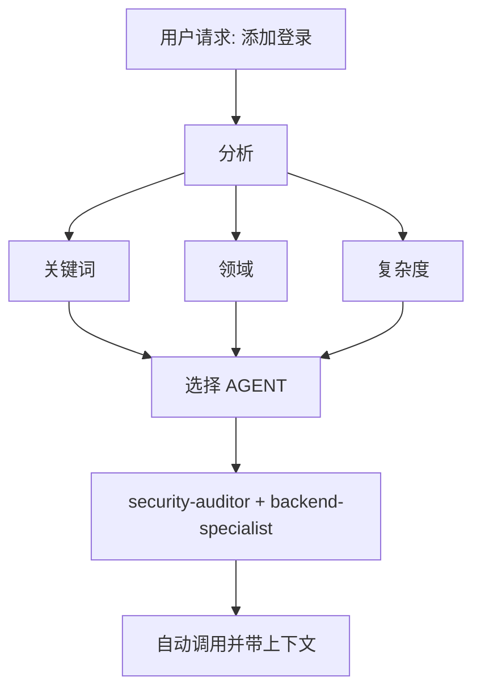

# Intelligent Agent Routing - 智能 Agent 路由

**目的**: 自动分析用户请求并将其路由到最合适的专家 Agent，无需用户显式提及。

## 核心原则

> **AI 应充当智能项目经理**，分析每个请求并自动为该工作选择最佳专家。

## 工作原理

### 1. 请求分析 (Request Analysis)

在响应任何用户请求之前，执行自动分析：



### 2. Agent 选择矩阵

**使用此矩阵自动选择 Agent：**

| 用户意图 (Intent)              | 关键词 (Keywords)                              | 选定 Agent                                  | 自动调用? |
| ------------------------------ | ---------------------------------------------- | ------------------------------------------- | --------- |
| **认证 (Authentication)**      | "login", "auth", "signup", "password"          | `security-auditor` + `backend-specialist`   | ✅ 是     |
| **UI 组件 (UI Component)**     | "button", "card", "layout", "style"            | `frontend-specialist`                       | ✅ 是     |
| **移动端 UI (Mobile UI)**      | "screen", "navigation", "touch", "gesture"     | `mobile-developer`                          | ✅ 是     |
| **API 端点 (API Endpoint)**    | "endpoint", "route", "API", "POST", "GET"      | `backend-specialist`                        | ✅ 是     |
| **数据库 (Database)**          | "schema", "migration", "query", "table"        | `database-architect` + `backend-specialist` | ✅ 是     |
| **Bug 修复 (Bug Fix)**         | "error", "bug", "not working", "broken"        | `debugger`                                  | ✅ 是     |
| **测试 (Test)**                | "test", "coverage", "unit", "e2e"              | `test-engineer`                             | ✅ 是     |
| **部署 (Deployment)**          | "deploy", "production", "CI/CD", "docker"      | `devops-engineer`                           | ✅ 是     |
| **安全审查 (Security Review)** | "security", "vulnerability", "exploit"         | `security-auditor` + `penetration-tester`   | ✅ 是     |
| **性能 (Performance)**         | "slow", "optimize", "performance", "speed"     | `performance-optimizer`                     | ✅ 是     |
| **产品定义 (Product Def)**     | "requirements", "user story", "backlog", "MVP" | `product-owner`                             | ✅ 是     |
| **新功能 (New Feature)**       | "build", "create", "implement", "new app"      | `orchestrator` → multi-agent                | ⚠️ 先询问 |
| **复杂任务 (Complex Task)**    | 检测到多个领域                                 | `orchestrator` → multi-agent                | ⚠️ 先询问 |

### 3. 自动路由协议

## TIER 0 - 自动分析 (始终激活)

在响应任何请求之前：

```javascript
// 决策树伪代码
function analyzeRequest(userMessage) {
    // 1. 分类请求类型
    const requestType = classifyRequest(userMessage);

    // 2. 检测领域
    const domains = detectDomains(userMessage);

    // 3. 确定复杂度
    const complexity = assessComplexity(domains);

    // 4. 选择 agent(s)
    if (complexity === "SIMPLE" && domains.length === 1) {
        return selectSingleAgent(domains[0]);
    } else if (complexity === "MODERATE" && domains.length <= 2) {
        return selectMultipleAgents(domains);
    } else {
        return "orchestrator"; // 复杂任务
    }
}
```

## 4. 响应格式 (Response Format)

**自动选择 Agent 时，简明扼要地告知用户：**

```markdown
🤖 **正在应用 `@security-auditor` + `@backend-specialist` 的知识...**

[继续进行专业响应]
```

**好处:**

- ✅ 用户看到正在应用哪方面的专业知识
- ✅ 透明的决策
- ✅ 仍然是自动的 (不需要 /commands)

## 领域检测规则 (Domain Detection Rules)

### 单领域任务 (自动调用单个 Agent)

| 领域            | 模式                                       | Agent                   |
| --------------- | ------------------------------------------ | ----------------------- |
| **Security**    | auth, login, jwt, password, hash, token    | `security-auditor`      |
| **Frontend**    | component, react, vue, css, html, tailwind | `frontend-specialist`   |
| **Backend**     | api, server, express, fastapi, node        | `backend-specialist`    |
| **Mobile**      | react native, flutter, ios, android, expo  | `mobile-developer`      |
| **Database**    | prisma, sql, mongodb, schema, migration    | `database-architect`    |
| **Testing**     | test, jest, vitest, playwright, cypress    | `test-engineer`         |
| **DevOps**      | docker, kubernetes, ci/cd, pm2, nginx      | `devops-engineer`       |
| **Debug**       | error, bug, crash, not working, issue      | `debugger`              |
| **Performance** | slow, lag, optimize, cache, performance    | `performance-optimizer` |
| **SEO**         | seo, meta, analytics, sitemap, robots      | `seo-specialist`        |
| **Game**        | unity, godot, phaser, game, multiplayer    | `game-developer`        |

### 多领域任务 (自动调用 Orchestrator)

如果请求匹配 **不同类别的 2+ 个领域**，自动使用 `orchestrator`：

```text
示例: "创建一个带有暗色模式 UI 的安全登录系统"
→ 检测到: Security + Frontend
→ 自动调用: orchestrator
→ Orchestrator 将处理: security-auditor, frontend-specialist, test-engineer
```

## 复杂度评估 (Complexity Assessment)

### 简单 (SIMPLE) (直接调用 Agent)

- 单文件编辑
- 清晰、具体的任务
- 仅一个领域
- 示例: "修复登录按钮样式"

**行动**: 自动调用各自的 Agent

### 中等 (MODERATE) (2-3 agents)

- 影响 2-3 个文件
- 清晰的需求
- 最多 2 个领域
- 示例: "为用户个人资料添加 API 端点"

**行动**: 顺序自动调用相关 Agent

### 复杂 (COMPLEX) (需要 Orchestrator)

- 多个文件/领域
- 需要架构决策
- 需求不明确
- 示例: "构建一个社交媒体应用"

**行动**: 自动调用 `orchestrator` → 将提出苏格拉底式问题

## 实现规则 (Implementation Rules)

### 规则 1: 静默分析 (Silent Analysis)

#### 不要宣布 "我正在分析你的请求..."

- ✅ 静默分析
- ✅ 告知正在应用哪个 Agent
- ❌ 避免冗长的元评论

### 规则 2: 告知 Agent 选择

**务必告知正在应用哪方面的专业知识：**

```markdown
🤖 **正在应用 `@frontend-specialist` 的知识...**

我将创建具有以下特征的组件：
[继续进行专业响应]
```

### 规则 3: 无缝体验 (Seamless Experience)

**用户不应感觉到与直接同对应的专家交谈有任何区别。**

### 规则 4: 覆盖能力 (Override Capability)

**用户仍然可以显式提及 Agent：**

```text
User: "使用 @backend-specialist 审查这个"
→ 覆盖自动选择
→ 使用显式提及的 Agent
```

## 边缘情况 (Edge Cases)

### 情况 1: 通用问题

```text
User: "React 是如何工作的？"
→ 类型: QUESTION
→ 不需要 Agent
→ 直接用解释回答
```

### 情况 2: 极度模糊的请求

```text
User: "把它弄好点"
→ 复杂度: UNCLEAR
→ 行动: 首先提出澄清问题
→ 然后路由到合适的 Agent
```

### 情况 3: 矛盾模式

```text
User: "给 Web 应用添加移动支持"
→ 冲突: mobile vs web
→ 行动: 问: "你想要响应式 Web 还是原生 App？"
→ 然后相应地路由
```

## 与现有工作流集成

### 与 /orchestrate 命令

- **用户输入 `/orchestrate`**: 显式编排模式
- **AI 检测到复杂任务**: 自动调用 orchestrator (结果相同)

**区别**: 用户不需要知道命令的存在。

### 与苏格拉底之门 (Socratic Gate)

- **自动路由不绕过苏格拉底之门**
- 如果任务不明确，仍然先问问题
- 然后路由到合适的 Agent

### 与 GEMINI.md 规则

- **优先级**: GEMINI.md 规则 > intelligent-routing
- 如果 GEMINI.md 指定了显式路由，遵循它
- 智能路由是无显式规则时的 **默认** 行为

## 测试系统

### 测试案例

#### 测试 1: 简单前端任务

```text
User: "创建一个暗色模式切换按钮"
预期: 自动调用 frontend-specialist
验证: 响应显示 "正在应用 @frontend-specialist"
```

#### 测试 2: 安全任务

```text
User: "审查认证流程的漏洞"
预期: 自动调用 security-auditor
验证: 安全侧重的分析
```

#### 测试 3: 复杂多领域

```text
User: "构建一个具有实时通知的聊天应用"
预期: 自动调用 orchestrator
验证: 多个 Agent 协调 (backend, frontend, test)
```

#### 测试 4: Bug 修复

```text
User: "登录不工作，出现 401 错误"
预期: 自动调用 debugger
验证: 系统化调试方法
```

## 性能考量

### Token 使用

- 分析每个请求增加 ~50-100 token
- 权衡: 更好的准确性 vs 轻微的开销
- 总体上通过减少来回沟通 **节省** token

### 响应时间

- 分析是即时的 (模式匹配)
- 无需额外的 API 调用
- Agent 选择发生在第一次响应之前

## 用户教育

### 可选: 首次解释

如果是项目中的第一次互动：

```markdown
💡 **提示**: 我已配置自动专家 Agent 选择。
我将通过分析您的任务始终为您选择最合适的专家。
如果您愿意，仍然可以显式提及 `@agent-name`。
```

## 调试 Agent 选择

### 启用调试模式 (用于开发)

临时添加到 GEMINI.md：

```markdown
## DEBUG: Intelligent Routing

显示选择理由：

- 检测到的领域: [列表]
- 选定的 Agent: [名称]
- 理由: [原因]
```

## 总结

**intelligent-routing skill 启用：**

✅ 零命令操作 (无需 `/orchestrate`)
✅ 基于请求分析的自动专家选择
✅ 透明地沟通正在应用的专业知识
✅ 与现有工作流无缝集成
✅ 显式提及 Agent 的覆盖能力
✅ 复杂任务回退到 Orchestrator

**结果**: 用户获得专家级的响应，而无需了解系统架构。

---

**下一步**: 将此 skill 集成到 GEMINI.md TIER 0 规则中。
