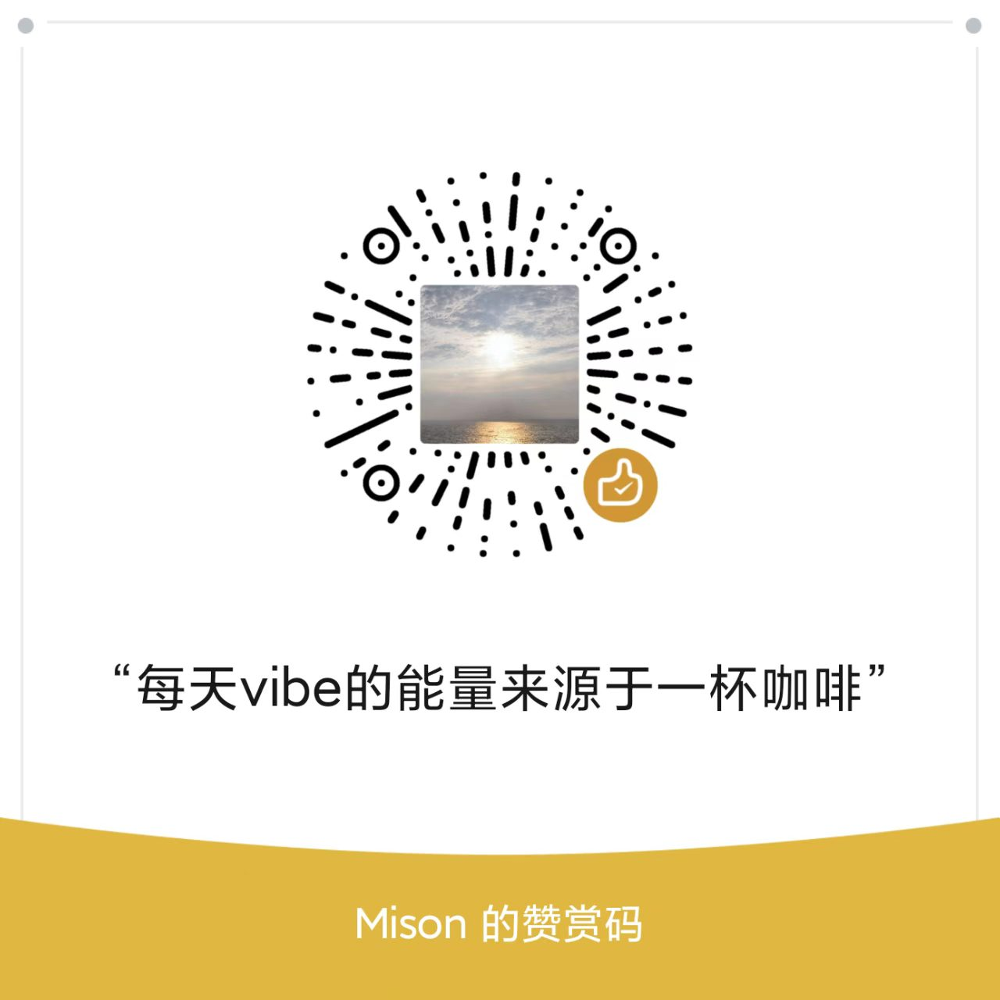

# Antigravity Kit CN

> 包含 Agent（智能体）、Skill（技能）与 Workflow（工作流）的 AI Agent 模板
>
> [!NOTE]
> 本仓库基于上游 vudovn/antigravity-kit 同步更新并进行中文化，同时提供 Codex（代码智能体环境）适配。

## 快速安装

```bash
git clone https://github.com/MisonL/antigravity-kit-cn.git
cd antigravity-kit-cn
npm install -g .
```

然后在你的目标项目中初始化：

```bash
cd /path/to/your-project
ag-kit init --target gemini   # 安装 Gemini 结构（.agent）
ag-kit init --target codex    # 安装 Codex 结构（.agents + 托管规则注入）
# 或者直接 ag-kit init，在交互中选择目标
```

可选：不做全局安装，直接在仓库目录执行：

```bash
cd /path/to/antigravity-kit-cn
node bin/ag-kit.js init --target codex --path /path/to/your-project
```

这会把所选目标结构安装到你的项目中（`gemini -> .agent`，`codex -> .agents`），并把 Codex 托管规则注入工作区 `AGENTS.md` 与 `antigravity.rules`。

### 关于 `.gitignore` 的重要说明

如果你正在使用 **Cursor** 或 **Windsurf** 等 AI 编辑器，将 `.agent/`、`.agents/` 添加到 `.gitignore` 可能会阻止 IDE 索引工作流，导致斜杠命令（如 `/plan`, `/debug`）无法出现在对话建议中。

推荐方案：
1. 确保 `.agent/`、`.agents/` **不要** 出现在项目的 `.gitignore` 中。
2. 作为替代方案，将其加入本地排除文件：`.git/info/exclude`。

## 包含内容

| 组件 | 数量 | 描述 |
| --- | --- | --- |
| Agents（智能体） | 20 | 专家级 AI 人设（前端、后端、安全、产品、QA 等） |
| Skills（技能） | 38 | 特定领域的知识模块 |
| Workflows（工作流） | 11 | 斜杠命令流程 |

## 使用方法

### 使用智能体

无需显式提及 Agent（智能体），系统会自动检测并应用合适专家：

```
你："添加 JWT 认证"
AI：🤖 正在应用 @security-auditor + @backend-specialist...

你："修复深色模式按钮"
AI：🤖 正在使用 @frontend-specialist...

你："登录返回 500 错误"
AI：🤖 正在使用 @debugger 进行系统化分析...
```

工作原理：
- 静默分析请求
- 自动检测领域（前端、后端、安全等）
- 选择最佳专家
- 告知你正在应用哪方面的专业知识
- 无需了解系统架构即可获得专家级响应

优势：
- ✅ 零学习曲线：描述需求即可
- ✅ 始终获得专家响应
- ✅ 透明：显示正在使用的智能体
- ✅ 仍可显式提及智能体进行覆盖

### 使用工作流

使用斜杠命令调用工作流：

| 命令 | 描述 |
| --- | --- |
| `/brainstorm` | 在实施前探索方案 |
| `/create` | 创建新功能或应用 |
| `/debug` | 系统化调试 |
| `/deploy` | 部署应用 |
| `/enhance` | 改进现有代码 |
| `/orchestrate` | 多智能体协同 |
| `/plan` | 创建任务拆解 |
| `/preview` | 本地预览变更 |
| `/status` | 检查项目状态 |
| `/test` | 生成并运行测试 |
| `/ui-ux-pro-max` | 50 种风格的设计 |

示例：

```
/brainstorm 认证系统
/create 带 Hero 部分的着陆页
/debug 为什么登录失败
```

### 使用技能

技能会根据任务上下文自动加载。AI 会阅读技能描述并应用相关知识。

## CLI 工具

CLI（命令行界面）工具：

| 命令 | 描述 |
| --- | --- |
| `ag-kit init` | 安装指定目标：gemini/codex |
| `ag-kit update` | 更新当前项目已安装目标 |
| `ag-kit update-all` | 批量更新所有已登记工作区 |
| `ag-kit doctor` | 诊断安装完整性（可 `--fix` 自愈） |
| `ag-kit exclude` | 管理全局索引排除清单 |
| `ag-kit status` | 检查安装状态 |

### 常用选项

```bash
ag-kit init --target gemini --path ./myapp        # 安装 Gemini 到指定目录
ag-kit init --target codex --path ./myapp         # 安装 Codex 到指定目录
ag-kit init --targets gemini,codex --path ./myapp # 一次安装多个目标
ag-kit init --non-interactive --target codex      # 非交互模式必须显式指定目标
ag-kit init --target codex --no-index --path ./tmp-workspace # 安装但不写入全局索引
ag-kit init --branch dev --force                  # 覆盖安装并指定分支
ag-kit init --quiet --dry-run                     # 预览操作而不执行
ag-kit update --target codex --path ./myapp       # 更新指定目标（默认会刷新索引）
ag-kit update --target codex --no-index --path ./myapp # 更新但不刷新索引
ag-kit doctor --target codex --fix --path ./myapp # 检查并自动修复
ag-kit update-all --targets codex                 # 批量更新所有登记工作区里的 codex 目标
ag-kit update-all --prune-missing                 # 清理索引中已失效的路径
ag-kit exclude list                               # 查看排除清单
ag-kit exclude add --path /path/to/dir            # 新增排除路径
ag-kit exclude remove --path /path/to/dir         # 删除排除路径
```

### 批量更新机制

- 执行 `ag-kit init` / `ag-kit update` 时，会把工作区路径登记到全局索引文件：
  - macOS / Linux / WSL: `~/.ag-kit/workspaces.json`
  - Windows PowerShell / CMD: `%USERPROFILE%\.ag-kit\workspaces.json`
- 默认会自动排除 antigravity-kit 源码目录和系统临时目录（如 macOS `/var/folders/...`、Linux `/tmp`、Windows `%TEMP%`）。
- 可通过 `--no-index` 让 `init/update` 跳过索引登记（适合临时验证目录）。
- `ag-kit update` 只依赖当前目录（或 `--path` 指定目录）的已安装目标，不依赖全局索引。
- 执行 `ag-kit update-all` 时，会遍历索引并批量更新每个工作区（可通过 `--targets` 限定目标）。
- 可用 `--prune-missing` 自动移除索引里已失效的工作区路径。
- 对于历史项目（尚未登记，或曾经 `--no-index` 跳过登记），可在该项目执行一次不带 `--no-index` 的 `ag-kit update`（或 `ag-kit init --force`）后纳入索引。
- 可通过 `ag-kit exclude add/remove/list` 维护自定义排除路径（支持排除整棵目录树）。
- 也可通过环境变量 `AG_KIT_INDEX_PATH` 指定自定义索引路径。

## 卸载

### 卸载本机全局 CLI

```bash
npm uninstall -g antigravity-kit-cn
```

如果你同时安装过别名或上游英文版，可一并清理：

```bash
npm uninstall -g antigravity-kit @vudovn/ag-kit
```

### 卸载某个项目内的 Antigravity Kit

macOS / Linux / WSL:

```bash
cd /path/to/your-project
rm -rf .agent .agents .agents-backup .codex
```

Windows PowerShell:

```powershell
Set-Location C:\path\to\your-project
Remove-Item .agent,.agents,.agents-backup,.codex -Recurse -Force -ErrorAction SilentlyContinue
```

Windows CMD:

```cmd
cd /d C:\path\to\your-project
rmdir /s /q .agent
rmdir /s /q .agents
rmdir /s /q .agents-backup
rmdir /s /q .codex
```

### 清理批量更新索引（可选）

```bash
ag-kit exclude add --path /path/to/your-project
```

说明：全局卸载只会移除 `ag-kit` 命令，不会删除你本地 clone 的源码目录。

## 请我喝咖啡

> 本项目由 **Mison** 进行汉化处理与额外功能开发。

<table>
  <tr>
    <td align="center" width="50%">
      <strong>支持 Mison（本仓库维护者）</strong><br />
      <br />
      <sub>微信赞赏码</sub>
    </td>
    <td align="center" width="50%">
      <strong>感谢上游作者 vudovn 创建并维护 Antigravity-Kit</strong><br />
      <a href="https://buymeacoffee.com/vudovn">
        
      </a><br />
      
    </td>
  </tr>
</table>

## 许可证

MIT © Vudovn, Mison
