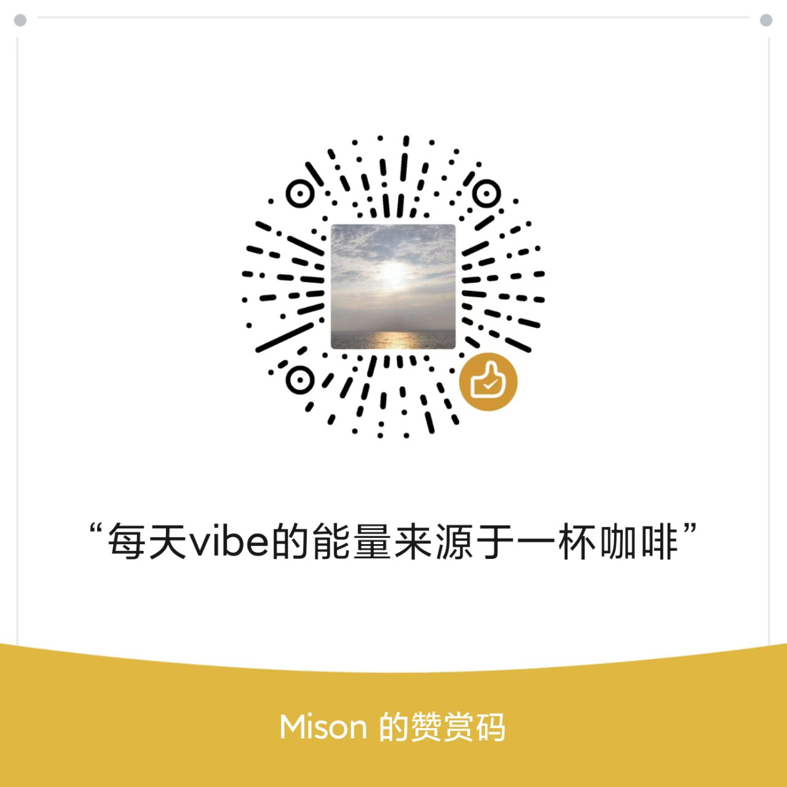

# Antigravity Kit CN

[](https://www.npmjs.com/package/@mison/ag-kit-cn)
[](https://www.npmjs.com/package/@mison/ag-kit-cn)
[](LICENSE)

> 面向 Antigravity 与 Codex 的中文 AI Agent 模板工具包，提供 Skills、Agents、Workflows 与 ag-kit CLI 的一键安装、更新和治理。
>
> [!NOTE]
> 本仓库基于上游 vudovn/antigravity-kit 同步更新并进行中文化，同时提供 Codex（代码智能体环境）适配。

## 快速安装

```bash
npm install -g @mison/ag-kit-cn
```

运行环境要求：Node.js `>=18`（建议使用当前 LTS）。

然后在你的目标项目中初始化：

```bash
cd /path/to/your-project
ag-kit init                   # 统一 full 安装（.agents 为主目录）
# 兼容参数仍可用，但会归一为 full
ag-kit init --target codex
ag-kit init --target gemini
```

可选：不做全局安装，直接在仓库目录执行：

```bash
cd /path/to/antigravity-kit-cn
node bin/ag-kit.js init --path /path/to/your-project
```

如需源码开发安装：

```bash
git clone https://github.com/MisonL/antigravity-kit-cn.git
cd antigravity-kit-cn
npm install -g .
```

安装会统一写入 `.agents`，并自动生成兼容投影（`.agent`、`.gemini`），同时把托管内容注入工作区 `AGENTS.md` 与 `antigravity.rules`（说明性托管区块，不是 Codex 官方 `.rules` 审批策略文件）。

### Codex 规则边界说明

- `antigravity.rules`：本项目生成并注入的托管说明文件，用于记录受管资源与运维约束。
- `.rules`（如 `~/.codex/rules/default.rules`）：Codex 官方的命令审批/执行策略文件（Starlark 规则，支持 `prefix_rule()`）。
- 默认行为：本项目不会自动写入你的全局 `~/.codex/rules`，避免引入不可预期的全局副作用。
- 如需启用官方 `.rules` 审批策略，请参考 `docs/codex-rules-template.md`。

### ⚠️ 关于 `.gitignore` 的重要说明

如果你正在使用 **Cursor** 或 **Windsurf** 等 AI 编辑器，将 `.agent/`、`.agents/`、`.gemini/` 添加到 `.gitignore` 可能会阻止 IDE 索引工作流，导致斜杠命令（如 `/plan`、`/debug`）无法出现在对话建议中。

**推荐方案：**
1. 确保 `.agent/`、`.agents/`、`.gemini/` **不要** 出现在项目的 `.gitignore` 中。
2. 作为替代方案，将其加入本地排除文件：`.git/info/exclude`。

## 包含内容

| 组件 | 数量 | 描述 |
| --- | --- | --- |
| Agents（智能体） | 20 | 专家级 AI 人设（前端、后端、安全、产品、QA 等） |
| Skills（技能） | 37 | 特定领域的知识模块 |
| Workflows（工作流） | 12 | 斜杠命令流程 |

## 使用方法

### 使用智能体

**无需显式提及智能体！** 系统会自动检测并应用合适专家：

```
你："添加 JWT 认证"
AI：🤖 正在应用 @security-auditor + @backend-specialist...

你："修复深色模式按钮"
AI：🤖 正在使用 @frontend-specialist...

你："登录返回 500 错误"
AI：🤖 正在使用 @debugger 进行系统化分析...
```

**工作原理：**

- 静默分析请求
- 自动检测领域（前端、后端、安全等）
- 选择最佳专家
- 告知你正在应用哪方面的专业知识
- 无需了解系统架构即可获得专家级响应

**优势：**

- ✅ 零学习曲线：描述需求即可
- ✅ 始终获得专家响应
- ✅ 透明：显示正在使用的智能体
- ✅ 仍可显式提及智能体进行覆盖

### 使用工作流

使用斜杠命令调用工作流：

| 命令 | 描述 |
| --- | --- |
| `/brainstorm` | 在实施前探索方案 |
| `/create` | 创建新功能或应用 |
| `/debug` | 系统化调试 |
| `/deploy` | 部署应用 |
| `/enhance` | 改进现有代码 |
| `/orchestrate` | 多智能体协同 |
| `/plan` | 创建任务拆解 |
| `/preview` | 本地预览变更 |
| `/restore-localize-compat` | 文档机制对齐与语义汉化流程（维护工作流） |
| `/status` | 检查项目状态 |
| `/test` | 生成并运行测试 |
| `/ui-ux-pro-max` | 50 种风格的设计 |

示例：

```
/brainstorm 认证系统
/create 带 Hero 部分的着陆页
/debug 为什么登录失败
```

### 使用技能

技能会根据任务上下文自动加载。AI 会阅读技能描述并应用相关知识。

## CLI 工具

CLI（命令行界面）工具：

| 命令 | 描述 |
| --- | --- |
| `ag-kit init` | 安装统一 full 结构（`.agents` + 兼容投影） |
| `ag-kit update` | 更新当前项目（自动收敛 legacy 目录） |
| `ag-kit update-all` | 批量更新所有已登记工作区 |
| `ag-kit verify` | 三平台（Codex/Gemini/Antigravity）可用性与一致性检查 |
| `ag-kit rollback` | 一键回退到升级前快照（默认最近一次） |
| `ag-kit doctor` | 诊断安装完整性（可 `--fix` 自愈） |
| `ag-kit exclude` | 管理全局索引排除清单 |
| `ag-kit status` | 检查安装状态 |

### 常用选项

```bash
ag-kit init --path ./myapp                        # full 安装（.agents 主目录）
ag-kit init --target codex --path ./myapp         # 兼容写法，仍归一为 full
ag-kit init --target gemini --path ./myapp        # 兼容写法，仍归一为 full
ag-kit init --non-interactive --path ./myapp      # 非交互默认 full
ag-kit init --disable-agent-projection --path ./myapp  # 停用 .agent 兼容投影（避免重复规则扫描）
ag-kit init --no-index --path ./tmp-workspace     # 安装但不写入全局索引
ag-kit init --branch dev --force                  # 覆盖安装并指定分支
ag-kit init --quiet --dry-run                     # 预览操作而不执行
ag-kit update --path ./myapp                      # 更新并收敛 legacy
ag-kit update --target codex --path ./myapp       # 兼容写法，仍归一为 full
ag-kit update --accept-legacy-agent --path ./myapp # 迁移仅 .agent 的旧版安装到 v3
ag-kit update --non-interactive --path ./myapp    # 非交互更新（CI 推荐）
ag-kit update --disable-agent-projection --path ./myapp # 删除/停用托管 .agent 投影
ag-kit update --no-index --path ./myapp           # 更新但不刷新索引
ag-kit verify --path ./myapp                      # 三平台可用性检查（人类可读输出）
ag-kit verify --path ./myapp --json               # 结构化输出（CI 推荐）
ag-kit rollback --path ./myapp                    # 回退到最近一次快照
ag-kit rollback --path ./myapp --backup <ts>      # 指定备份时间戳回退
ag-kit rollback --path ./myapp --dry-run          # 预演回退操作
ag-kit doctor --fix --path ./myapp                # 检查并自动修复
ag-kit update-all --targets full                  # 批量更新登记工作区
ag-kit update-all --prune-missing                 # 清理索引中已失效的路径
ag-kit exclude list                               # 查看排除清单
ag-kit exclude add --path /path/to/dir            # 新增排除路径
ag-kit exclude remove --path /path/to/dir         # 删除排除路径
```

### 升级指引

- 旧项目升级到 `3.0.0-beta.0`：`docs/migration-v3-beta.md`
- 首轮执行 `init/update/update-all/doctor --fix` 时，会按全局索引对受管 legacy 工作区执行一次自动迁移。

### 批量更新机制

- 执行 `ag-kit init` / `ag-kit update` 时，会把工作区路径登记到全局索引文件：
  - macOS / Linux / WSL: `~/.ag-kit/workspaces.json`
  - Windows PowerShell / CMD: `%USERPROFILE%\.ag-kit\workspaces.json`
- 默认会自动排除 Ag-Kit 工具包源码目录和系统临时目录（如 macOS `/var/folders/...`、`/tmp`、`/private/tmp`，Linux `/tmp`，Windows `%TEMP%`）。
- 可通过 `--no-index` 让 `init/update` 跳过索引登记（适合临时验证目录）。
- `ag-kit update` 只依赖当前目录（或 `--path` 指定目录）的已安装目标，不依赖全局索引。
- 执行 `ag-kit update-all` 时，会遍历索引并批量更新每个工作区（可通过 `--targets` 限定目标）。
- 在交互终端执行 `ag-kit update-all` 时，若某个工作区存在 `.agent` / `.gemini/agents` 冲突，会按工作区询问处理策略；`.agent` 支持「备份替换 / 直接替换 / 保留 / 改名失效 / 停用投影」。
- 非交互环境默认 `.agent` 备份替换、`.gemini/agents` 追加；如需避免 `.agent` 重复扫描，可加 `--disable-agent-projection`。
- 可用 `--prune-missing` 自动移除索引里已失效的工作区路径。
- 对于历史项目（尚未登记，或曾经 `--no-index` 跳过登记），可在该项目执行一次不带 `--no-index` 的 `ag-kit update`（或 `ag-kit init --force`）后纳入索引。
- 可通过 `ag-kit exclude add/remove/list` 维护自定义排除路径（支持排除整棵目录树）。
- 也可通过环境变量 `AG_KIT_INDEX_PATH` 指定自定义索引路径。
- 自动迁移状态默认在 `~/.ag-kit/migrations/v3.json`，可用 `AG_KIT_MIGRATION_STATE_PATH` 自定义。
- 如需跳过自动迁移，可设置 `AG_KIT_SKIP_AUTO_MIGRATION=1`（`--no-index` 也会跳过自动迁移以避免全局副作用）。
- `ag-kit status` 会显示 `Auto-Migration(v3): done|pending`（只读状态）。
- `ag-kit rollback` 默认回退到最近一次快照；快照在升级/安装前自动写入 `~/.ag-kit/backups/<workspace-key>/<timestamp>/rollback-manifest.json`。
- 可通过 `AG_KIT_BACKUP_ROOT` 自定义快照根目录（CI 或隔离测试推荐）。

### 开发维护命令

```bash
npm run clean           # 清理本地生成产物（如 web/.next、web/node_modules）
npm run clean:dry-run   # 预览将被清理的路径
npm test                # 只执行 tests/ 目录下测试
npm run health-check    # 一键执行全链路健康复检
npm run verify:3platform -- --path /path/to/workspace  # 三平台可用性与配置一致性检查
```

如果你在 `web/` 子项目内开发，可按需执行：

```bash
npm install --prefix web
npm run lint --prefix web
```

### CI 与分支门禁

- 仓库内置 GitHub Actions 工作流：`.github/workflows/ci.yml`。
- PR 到 `main` / `preview/agents-v3` 会执行两个检查：
  - `CI / test`
  - `CI / health-check`
- 建议在仓库 Branch Protection 中将以上两项设为 Required status checks，避免未验证改动直接合并。

## 卸载

### 卸载本机全局 CLI

```bash
npm uninstall -g @mison/ag-kit-cn
```

如果你同时安装过别名或上游英文版，可一并清理：

```bash
npm uninstall -g antigravity-kit-cn antigravity-kit @vudovn/ag-kit
```

### 卸载某个项目内的 Antigravity Kit

macOS / Linux / WSL:

```bash
cd /path/to/your-project
rm -rf .agent .agents .agents-backup .gemini antigravity.rules
# 如需清理 v3 新版全局回退快照：
# rm -rf ~/.ag-kit/backups
# 若确认 .codex 是本工具托管 legacy（含 manifest.json 且 target=codex/full），可再删除：
# rm -rf .codex
```

Windows PowerShell:

```powershell
Set-Location C:\path\to\your-project
Remove-Item .agent,.agents,.agents-backup,.gemini,antigravity.rules -Recurse -Force -ErrorAction SilentlyContinue
# 如需清理 v3 新版全局回退快照：
# Remove-Item "$env:USERPROFILE\.ag-kit\backups" -Recurse -Force -ErrorAction SilentlyContinue
# 若确认 .codex 为本工具托管 legacy，再手动删除 .codex
```

Windows CMD:

```cmd
cd /d C:\path\to\your-project
rmdir /s /q .agent
rmdir /s /q .agents
rmdir /s /q .agents-backup
rmdir /s /q .gemini
del /f /q antigravity.rules
REM 若确认 .codex 为本工具托管 legacy，再手动删除 .codex
REM 如需清理 v3 新版全局回退快照:
REM rmdir /s /q %USERPROFILE%\.ag-kit\backups
```

### 清理批量更新索引（可选）

```bash
ag-kit exclude add --path /path/to/your-project
```

说明：全局卸载只会移除 `ag-kit` 命令，不会删除你本地 clone 的源码目录。

## 请我喝咖啡

> 本项目由 **Mison** 进行汉化处理与额外功能开发。

<table>
  <tr>
    <td align="center" width="50%">
      <strong>支持 Mison（本仓库维护者）</strong><br />
      <br />
      <sub>微信赞赏码</sub>
    </td>
    <td align="center" width="50%">
      <strong>感谢上游作者 vudovn 创建并维护 Antigravity-Kit</strong><br />
      <a href="https://buymeacoffee.com/vudovn">
        
      </a><br />
      
    </td>
  </tr>
</table>

## 许可证

MIT © Vudovn, Mison
