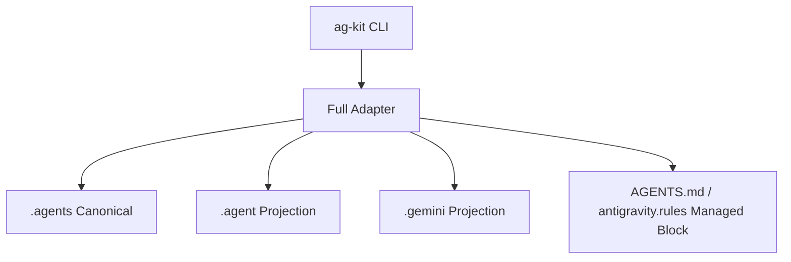

# 多目标适配器（v3 Full）

当前版本采用统一 full 架构：`.agents` 为唯一主目录，`.agent` 与 `.gemini` 为兼容投影。

## 架构概览



## 设计原则

1. 单一事实源：只维护 `.agents`。
2. 兼容投影：对 Antigravity/Gemini/Codex 做最小兼容输出。
3. 只处理托管文件：非托管 `.codex`、用户 `.gemini` 自定义文件不被覆盖删除。
4. 冲突可恢复：覆盖前统一备份到 `~/.ag-kit/backups/<workspace-key>/<timestamp>/`（兼容读取旧版 `.agents-backup`）。

## 命令语义

```bash
ag-kit sync
ag-kit init
ag-kit update
ag-kit update-all --targets full
ag-kit doctor --fix
```

- `--target gemini|codex` 仍兼容，但归一到 full 流程。
- `status` 显示 canonical/projection/legacy 状态。

## Legacy 迁移

- 支持读取历史 `.agent`、托管 `.codex`、`.gemini` 并收敛到 `.agents`。
- 非托管 `.codex` 保留，仅做提示。

## MCP 双通道

`.agents/mcp_config.json` 与 `.gemini/settings.json` 会同步主备 Context7：
- `context7`（官方）
- `context7_backup`（备用）

执行约定：优先 `context7`，官方不可用时再尝试 `context7_backup`。
